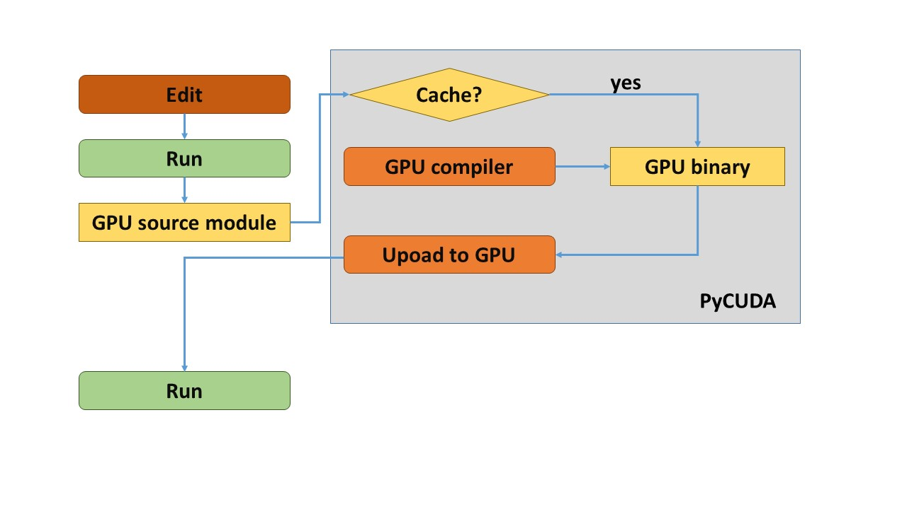
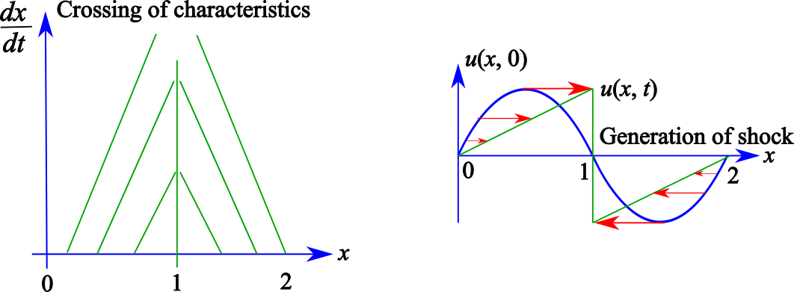
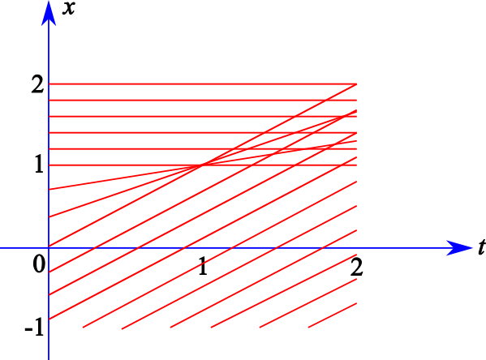
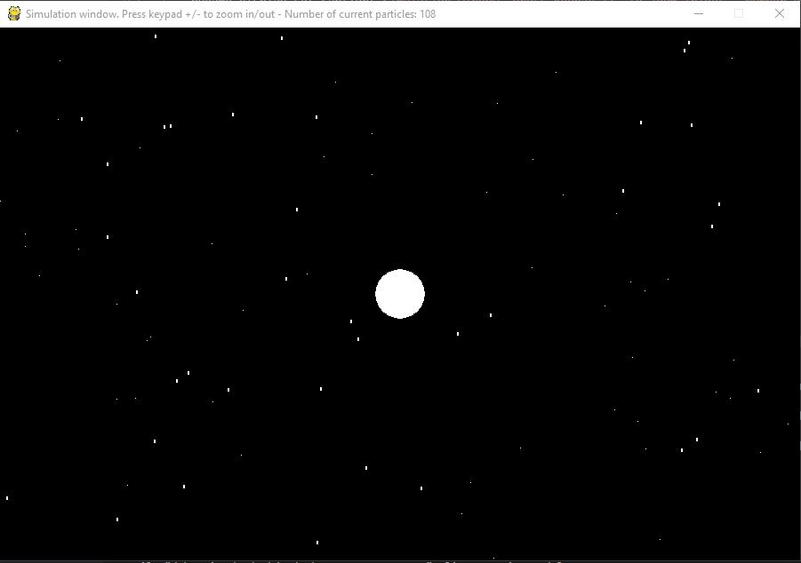

# Problem solving with PyCUDA

<p align="center">
  
</p>

The idea behind the use of parallel programming on GPU is accelerating the most computationally burdened parts of a code. In [Writing CUDA kernels for interpolation](https://vitalitylearning2021.github.io/interpolationCUDA/) and [Numerical quadrature in CUDA with reusable software](https://vitalitylearning2021.github.io/quadratureCUDA/), we have seen how this can be performed using proper CUDA kernels, fully dealing with approaches implemented in C/Python/CUDA language. The initialization of parameters or arrays, the load/write of data files or else the handling of the code execution flow was performed in C/Python language whereas the computationally burdened part (interpolation or integration) was accelerated by CUDA.  
In many cases of practical interest, the initialization, data exchange or management phases are unburdened, so that the use of a language of higher level than C does not penalize the execution times. Moreover, exploiting off-the-shelf routines available in higher level languages as, for example, data load/write or graphics, could be convenient being them more easily used than C/Python.  
Python is one of the highest level languages that has taken hold in the last years since high-performance routines are available, it is free and it benefits of a large audience of developers and users. Python has nowadays succeeded to be a standard for machine learning and artificial intelligence applications. On the heels of these considerations, the
PyCUDA library has been developed which enables to write and compile kernels in CUDA language and to integrate them with Python. In this way, such kernels are executed as they were ordinary Python functions, thus strongly simplifying the programming and the development of applications with acceleration achieved by parallel programming on GPU.  
In this project, we will provide an introduction to the PyCUDA library using a series of short examples in which we will illustrate the simplicity and the different possibilities to integrate CUDA programming in Python. Later on, we will describe the development of a couple of small projects of practical interest using PyCUDA. In particular, we will set up an approach to solve a simple first order, non-linear partial differential equation. To this end, the inviscid Burgers’ equation will be considered. Such an equation is physically meaningful and interesting since it enables dealing with the simulation of an amazing phenomenon known as *shock wave*. Finally, we will consider a simple approach for the particle simulation of an -body system based on the use of the Runge-Kutta scheme. The -body problem is, indeed, very common in applications since, depending on the relevant forces, it is of interest in many fields of science like gravitation or plasma physics, to mention only a couple of examples. Moreover, the Runge-Kutta method represents a widespread numerical scheme for the solution of ordinary differential equations. Finally, we will deal with a two-dimensional -body problem. We will also size the opportunity to illustrate a real-time visualization modality of the results based on the `pygame` library.  
Another indirect advantage of Python is that, recently, many services providing free Jupyter notebook environments have flourished requiring no setup and entirely running on the cloud. Examples are Google Colaboratory or Kaggle which enable also the parallel programming on GPU. These services enable any User having a simple internet connection
and a browser, but no significant computation facility at disposal, to access a virtual machine running PyCUDA among other libraries.  
In conclusion, in the present project we will deal with:

  - The PyCUDA library;
  - Integration of CUDA code in Python;
  - Inviscid Burgers’ equation and shock waves;
  - Runge-Kutta;
  - Simple -body problem;
  - An Ordinary Differential Equation (ODE);
  - A Partial Differential Equations (PDE);
  - `pygame` library.

## Getting started

In the following, we will provide an introduction to the PyCUDA library and short sample projects will be developed from which its main features can be gathered. From a theoretical point of view, no particular prerequisites are requested, apart from a basic knowledge of partial and ordinary differential equations and of gravitation laws. The necessary theoretical recalls will be provided anyways. From the programming point of view, we assume a basic knowledge of Python language.  
We begin, in the following section, to introduce the PyCUDA library.

## What is PyCUDA?

PyCUDA is a library developed by Andreas Kl<span>ö</span>ckner *et al.* [1](#PYCUDA1) allowing to write CUDA codes and compiling, optimizing and using them as ordinary Python functions in a totally transparent way to the User. The User, indeed, does not need to manage the CUDA compiler unless he explicitly requests it.  
PyCUDA uses the concept of GPU run-time code generation (RTCG) enabling the execution of low-level code launched by the high-level scripting language offered by Python. The use of RTCG increases the User’s productivity from different points of view.  
A first advantage of RTCG is related to the possibility of a low-level programming by writing CUDA kernels only for the portions of the code to be accelerated while using, for the remaining ones, all the functionalities of a high-level language, as graphics or I/O. RTCG enables a run-time code optimization instead of a compile-time one. The
former occurs at a more favorable time, when all the information on the machine on which the code must be executed is available. Also, the result of the compilation process is cached and reused if possible, initiating recompilation only when necessary. This is illustrated in figure [1](#PyCUDA_flow) where the compilation and caching operations in the gray box are performed transparently to the User. Finally, it is possible to fully exploit the potentialities of CUDA libraries thanks to the readiness of many wrappers in publicly available libraries or to construct such wrappers by oneself. In next chapters, we will provide an example of the wrapper availability for using the cuFFT library and of wrapper constructability for exploiting the cuSparse library. 
A second advantage of RTCG is associated to the possibility of using, within certain limits, a high-level, mathematical-like syntax for GPU executions.  
In order to illustrate the potentialities of the PyCUDA library, for didactic purposes, we illustrate some simple examples prior to move to true projects. However, first, some words are given on the environment which we will use to develop some of the examples and the projects below, namely, Google Colaboratory.

<p align="center">
  
  <br>
     <em>Figure 1. PyCUDA GPU program compilation workflow.</em>
</p>

## Google Colaboratory

Google Colaboratory, or Colab, is a totally free development environment based on Notebook Jupiter.  
Jupyter notebook is an open-source, free web application permitting to create and share documents containing codes, equations, text, plots, tables and images and that enables sharing codes on the GitHub platform. In particular, the code is any time modifiable and executable in real time. What implemented can be later exported as Python or `ipynb`
source, where `ipynb` is a format capable to host all the content of the Jupyter Notebook web application session and including the inputs and outputs of the computations, the images and the comments and that can be finally exported as `html`, `pdf` and `LaTeX`.  
Google Colab supports `Python 2.7` and `3.6` at the time of writing, does not request any configuration and accommodates the CPU, GPU or Tensor Processing Unit (TPU) execution, depending on the needs. It hosts libraries like PyTorch, TensorFlow, Keras and OpenCV, so that it is much used for Machine Learning, Deep Learning and also experiments for Computer Vision. It is possible, however, to install also other modules if necessary.  
In order to exploit Google Colab, it is enough to have a Google account and all the work can be saved on Google Drive.  
The first screen that is visualized when Google Colab is launched is a welcome project in which the different possibilities offered by the platform (figure [2](#Colab1)) appear.

<p align="center">
  
  <br>
     <em>Figure 2. Google Colab welcome page.</em>
</p>

It is possible to create a new notebook, for example in `Python 3.6`, by selecting `New notebook` from the `File` menu. To enable the current session to use the GPU, it is enough to click on `Change runtime type` of the `Runtime` menu and select `GPU` from the `Hardware accelerator` drop down menu. It is understood that, from now on, such selection should be operated to correctly run the shown examples. Obviously, the examples that will be described could also be executed locally on a PC.
In the Windows case, the use of `Visual Studio Code` is highly recommended.  
In next section, we will see how it is possible to list the properties of the GPU on which the computation is performed.

## Dumping the GPU properties

The first, very simple example that we will show in this chapter enables to dump the properties of the GPU card in use. The example is entirely shown in Listing [\[dumpPyCUDA\]](#dumpPyCUDA).

``` python
import pycuda.driver as cuda
import pycuda.autoinit

print("%d device(s) found." % cuda.Device.count())
 
dev = cuda.Device(0)
print("Device: %s", dev.name())
print("  Compute Capability: %d.%d" % dev.compute_capability())
print("  Total Memory: %s KB" % (dev.total_memory()//(1024)))
atts = [(str(att), value)
          for att, value in dev.get_attributes().items()]
atts.sort()
   
for att, value in atts:
  print("  %s: %s" % (att, value))
```
<p align="center" id="dumpPyCUDA" >
     <em>Listing 1. Dumping the GPU properties in PyCUDA.</em>
</p>

However, before launching the code, it is necessary to install PyCUDA under the Google Colab environment. This can be done by the following snippet

``` python
!pip install pycuda
```

Going back to the code in Listing [1](#dumpPyCUDA), it permits to illustrate the normal workflow of a PyCUDA code.  
In particular, the first step is to load the libraries as in a standard Python code. In the above example, two libraries are imported:

1.  `pycuda.driver`: contains functions for memory handling, as allocation, deallocation and transfers, for the dumping of information on the GPU card etc.; in the example, the `cuda` shorthand is given to `pycuda.driver`;
2.  `pycuda.autoinit`: does not use a shorthand notation and this call serves for the device initialization, memory cleanup and context creation;

The first operation performed in Listing [1](#dumpPyCUDA) is that of counting the number of available devices by means of `cuda.Device.count()`.  
The second is that of dumping the properties of the only available GPU, namely, GPU number `0`, in the `dev` variable.  
Later on, the GPU name stored in `dev.name()`, the compute capability stored in `dev.compute_capability()` and the available free memory (in bytes) stored in `dev.total_memory()` are shown.  
Finally, all the GPU attributes are ordered in an alphabetical order and displayed on screen.  
An example of output is shown in the following Listing:

``` python
1 device(s) found.
Device: %s Tesla P100-PCIE-16GB
  Compute Capability: 6.0
  Total Memory: 16671616 KB
  ASYNC_ENGINE_COUNT: 2
  CAN_MAP_HOST_MEMORY: 1
  CLOCK_RATE: 1328500
  COMPUTE_CAPABILITY_MAJOR: 6
  COMPUTE_CAPABILITY_MINOR: 0
  COMPUTE_MODE: DEFAULT
  CONCURRENT_KERNELS: 1
  ECC_ENABLED: 1
  GLOBAL_L1_CACHE_SUPPORTED: 1
  GLOBAL_MEMORY_BUS_WIDTH: 4096
  GPU_OVERLAP: 1
  INTEGRATED: 0
  KERNEL_EXEC_TIMEOUT: 0
  L2_CACHE_SIZE: 4194304
  LOCAL_L1_CACHE_SUPPORTED: 1
  MANAGED_MEMORY: 1
  MAXIMUM_SURFACE1D_LAYERED_LAYERS: 2048
  MAXIMUM_SURFACE1D_LAYERED_WIDTH: 32768
  MAXIMUM_SURFACE1D_WIDTH: 32768
  MAXIMUM_SURFACE2D_HEIGHT: 65536
  MAXIMUM_SURFACE2D_LAYERED_HEIGHT: 32768
  MAXIMUM_SURFACE2D_LAYERED_LAYERS: 2048
  MAXIMUM_SURFACE2D_LAYERED_WIDTH: 32768
  MAXIMUM_SURFACE2D_WIDTH: 131072
  MAXIMUM_SURFACE3D_DEPTH: 16384
  MAXIMUM_SURFACE3D_HEIGHT: 16384
  MAXIMUM_SURFACE3D_WIDTH: 16384
  MAXIMUM_SURFACECUBEMAP_LAYERED_LAYERS: 2046
  MAXIMUM_SURFACECUBEMAP_LAYERED_WIDTH: 32768
  MAXIMUM_SURFACECUBEMAP_WIDTH: 32768
  MAXIMUM_TEXTURE1D_LAYERED_LAYERS: 2048
  MAXIMUM_TEXTURE1D_LAYERED_WIDTH: 32768
  MAXIMUM_TEXTURE1D_LINEAR_WIDTH: 134217728
  MAXIMUM_TEXTURE1D_MIPMAPPED_WIDTH: 16384
  MAXIMUM_TEXTURE1D_WIDTH: 131072
  MAXIMUM_TEXTURE2D_ARRAY_HEIGHT: 32768
  MAXIMUM_TEXTURE2D_ARRAY_NUMSLICES: 2048
  MAXIMUM_TEXTURE2D_ARRAY_WIDTH: 32768
  MAXIMUM_TEXTURE2D_GATHER_HEIGHT: 32768
  MAXIMUM_TEXTURE2D_GATHER_WIDTH: 32768
  MAXIMUM_TEXTURE2D_HEIGHT: 65536
  MAXIMUM_TEXTURE2D_LINEAR_HEIGHT: 65000
  MAXIMUM_TEXTURE2D_LINEAR_PITCH: 2097120
  MAXIMUM_TEXTURE2D_LINEAR_WIDTH: 131072
  MAXIMUM_TEXTURE2D_MIPMAPPED_HEIGHT: 32768
  MAXIMUM_TEXTURE2D_MIPMAPPED_WIDTH: 32768
  MAXIMUM_TEXTURE2D_WIDTH: 131072
  MAXIMUM_TEXTURE3D_DEPTH: 16384
  MAXIMUM_TEXTURE3D_DEPTH_ALTERNATE: 32768
  MAXIMUM_TEXTURE3D_HEIGHT: 16384
  MAXIMUM_TEXTURE3D_HEIGHT_ALTERNATE: 8192
  MAXIMUM_TEXTURE3D_WIDTH: 16384
  MAXIMUM_TEXTURE3D_WIDTH_ALTERNATE: 8192
  MAXIMUM_TEXTURECUBEMAP_LAYERED_LAYERS: 2046
  MAXIMUM_TEXTURECUBEMAP_LAYERED_WIDTH: 32768
  MAXIMUM_TEXTURECUBEMAP_WIDTH: 32768
  MAX_BLOCK_DIM_X: 1024
  MAX_BLOCK_DIM_Y: 1024
  MAX_BLOCK_DIM_Z: 64
  MAX_GRID_DIM_X: 2147483647
  MAX_GRID_DIM_Y: 65535
  MAX_GRID_DIM_Z: 65535
  MAX_PITCH: 2147483647
  MAX_REGISTERS_PER_BLOCK: 65536
  MAX_REGISTERS_PER_MULTIPROCESSOR: 65536
  MAX_SHARED_MEMORY_PER_BLOCK: 49152
  MAX_SHARED_MEMORY_PER_MULTIPROCESSOR: 65536
  MAX_THREADS_PER_BLOCK: 1024
  MAX_THREADS_PER_MULTIPROCESSOR: 2048
  MEMORY_CLOCK_RATE: 715000
  MULTIPROCESSOR_COUNT: 56
  MULTI_GPU_BOARD: 0
  MULTI_GPU_BOARD_GROUP_ID: 0
  PCI_BUS_ID: 0
  PCI_DEVICE_ID: 4
  PCI_DOMAIN_ID: 0
  STREAM_PRIORITIES_SUPPORTED: 1
  SURFACE_ALIGNMENT: 512
  TCC_DRIVER: 0
  TEXTURE_ALIGNMENT: 512
  TEXTURE_PITCH_ALIGNMENT: 32
  TOTAL_CONSTANT_MEMORY: 65536
  UNIFIED_ADDRESSING: 1
  WARP_SIZE: 32
```

In the following section, we will provide more details of PyCUDA programming, showing five different ways to perform an elementwise vector summation.

## Getting started with PyCUDA: five different ways to sum vectors in PyCUDA

In order to construct the five examples, we will consider different possibilities offered by PyCUDA. In particular:

1.  the `SourceModule` module;
2.  the `ElementwiseKernel` module;
3.  the elementwise sum of two `gpuarray`’s by a natural mathematical
    expression.

The above different possibilities may have different performance so that we will incidentally assess it during the presentation.  
Let us begin with the first possibility offered by the use of `SourceModule`.

<p align="center" id="fiveDifferentVersionsVersion1" >
</p>
### Version \# 1: using `SourceModule`

The `SourceModule` module enables coding GPU processing by defining `__global__` functions as Python strings. As previously mentioned concerning the possibility of compiling CUDA code transparently to the User, the kernels defined as strings are compiled and then can be launched as regular Python functions. For the launch, there is only the
need to define the launch grid on the GPU. In the following, we will illustrate such first possibility in detail. The full code is contained in the `fivedifferentways_version1.py` file. Let us note that, for the sake of convenience, we will comment the instructions in an order different from that appearing in the `.py` file.  
The first necessary step, as in all Python codes, is that of importing the libraries. This is done by the following rows

    import numpy as np
    
    import pycuda.driver as cuda
    import pycuda.autoinit
    from pycuda.compiler import SourceModule

At variance with the previous section, we note that the `numpy` library and the `SourceModule` module are now also imported. The `numpy` library will serve to initialize the arrays on CPU. It should be noticed that there is a full compatibility between PyCUDA and `numpy` as it will be clarified in the subsequent sections.  
The following rows define the length `N` of the involved arrays along with the size `BLOCKSIZE` of a block of the GPU execution grid and to initialize the two CPU arrays to be summed up, namely, `h_a` and `h_b`. Such two arrays are cast to single precision.

``` 

N = 100000

BLOCKSIZE = 256

h_a = np.random.randn(1, N)
h_b = np.random.randn(1, N)

h_a = h_a.astype(np.float32)
h_b = h_b.astype(np.float32)
```

Subsequently, the space for the two arrays `d_a` and `d_b` to be summed up on GPU and for the result `d_c` is allocated. The two arrays to be summed up are transferred from the host to the device. This is performed thanks to the following rows :

``` python
d_a = cuda.mem_alloc(h_a.nbytes)
d_b = cuda.mem_alloc(h_b.nbytes)
d_c = cuda.mem_alloc(h_a.nbytes)

cuda.memcpy_htod(d_a, h_a)
cuda.memcpy_htod(d_b, h_b)
```
<p align="center" id="deviceAllocAndCopies" >
     <em>Listing 2. GPU allocation and memory copies from host to device.</em>
</p>

The kernel function, as said, is defined as a Python string assigned, after being decorated with `SourceModule`, to a certain variable, say `mod` in this example:

``` c++
mod = SourceModule("""
  #include <stdio.h>
  __global__ void deviceAdd(float * __restrict__ d_c, const float * __restrict__ d_a, const float * __restrict__ d_b, const int N)
  {
    const int tid = threadIdx.x + blockIdx.x * blockDim.x;
    if (tid >= N) return;
    d_c[tid] = d_a[tid] + d_b[tid];
  } 
  """)
```
<p align="center" id="SourceModuleVersion1" >
     <em>Listing 3. Defining a `SourceModule` function out of a `__global__` function.</em>
</p>

Once defined the kernel function as a string, it is necessary to “pull out” a reference to it that can be used in the pythonic workflow. This is achieved with the `get_function` method as follows:

``` python
deviceAdd = mod.get_function("deviceAdd")
```

At this point, we are almost ready to launch the kernel function. Before doing that, it is necessary to define the launch grid:

``` python
blockDim  = (BLOCKSIZE, 1, 1)
gridDim   = (int(iDivUp(N, BLOCKSIZE)), 1, 1)
```

As it can be seen, the launch grid is defined using the `iDivUp` function which is the analogous to that already presented in the initial chapters. In any case, its pythonic definition is reported in the following:

``` python
def iDivUp(a, b):
    # Round a / b to nearest higher integer value
    a = np.int32(a)
    b = np.int32(b)
    return (a / b + 1) if (a % b != 0) else (a / b)
```

We are now ready to launch the `deviceAdd` function as it were an ordinary Python function as

``` python
deviceAdd(d_c, d_a, d_b, np.int32(N), block = blockDim, grid = gridDim)
```

In order to measure the execution times and to assess the performance, the invokation to `deviceAdd` is decorated as follows:

``` python
start = cuda.Event()
end   = cuda.Event()
start.record()
deviceAdd(d_c, d_a, d_b, np.int32(N), block = blockDim, grid = gridDim)
end.record() 
end.synchronize()
secs = start.time_till(end) * 1e-3
print("Processing time = %fs" % (secs))
```

In the last algorithmic steps, the CPU array `h_c` which will be in charge to hosting the results of the GPU processing is defined and the data are moved from the device to the host.

``` python
h_c = np.empty_like(h_a)
cuda.memcpy_dtoh(h_c, d_c)
```
<p align="center" id="resultCopy" >
     <em>Listing 4. Allocating host space and copying the computation results from device to host.</em>
</p>

Finally, the device processing results are checked:

``` python
if np.array_equal(h_c, h_a + h_b):
  print("Test passed!")
else :
  print("Error!")
```

and the context `printf` buffer is flushed. Without flushing, no printout may be returned:

``` python
cuda.Context.synchronize()
```

It should be noticed that, to consistently measure the processing time, a first empty warm up  execution must be performed for the `deviceAdd` function. The execution time for the `deviceAdd` function has been `0.000102s`.

### Version \# 2: using `SourceModule` and copying data from host to device on-the-fly

The second version is the same as the foregoing one with the only exception that the copies from host to device and vice versa are not performed explicitly before the kernel launch, but rather implicitly. Implicit copies are executed on-the-fly by applying `cuda.In` to the host input arrays and `cuda.Out` to the output host array. In other
words, the lines in Listing [2](#deviceAllocAndCopies) and that referring to the explicit device-to-host copy in Listing [4](#resultCopy) are not necessary. Moreover, the call

``` python
deviceAdd(d_c, d_a, d_b, np.int32(N), block = blockDim, grid = gridDim)
```

of the previous code is changed by the line

``` python
deviceAdd(cuda.Out(h_c), cuda.In(h_a), cuda.In(h_b), np.int32(N), block = blockDim, grid = gridDim)
```

The code is now shorter, but simplicity is paid with execution times. Indeed, memory transfers now affect the computation time which becomes `0.000964s`.  
The full code is contained in the `fiveDifferentWays_version2.py` file.

### Version \# 3: using `gpuarray`s

In the third version, GPU arrays are dealt with by the `gpuarray` class.  
By such a class, PyCUDA is capable to automatically manage memory allocations, deallocations, data transfers and cleanup based on the lifetime in a transparent way to the User, so that there is no need to worry about freeing `gpuarray` objects where we are done with them.  
`gpuarray` works similarly to `numpy` and integrates with it. For example, to automatically create a `gpuarray` object and transfer a `numpy` array from host to device, it is enough to use the `to_gpu` method.  
Using the `gpuarray` class, the up to now discussed code is even simpler:

  - as compared to the previous versions, there is no need to define the kernel function;
  - as compared to Version \# 1, the allocations and the transfers from host to device are dealt with in a simple way using two lines of code:
    ``` python
    d_a = gpuarray.to_gpu(h_a)
        d_b = gpuarray.to_gpu(h_b)
    ```
  - the elementwise sum is then performed by using the possibility offered by such a class of expressing array operations on the GPU with a natural mathematical expression without explicitly coding a `__global__` function using `SourceModule`.

Once again, simplicity is paid with computation time: the execution time is now `1.117813s`.  
The full code of this Version is contained in the `fiveDifferentWays_version3.py` file.

### Version \# 4: using `ElementwiseKernel`

The PyCUDA `ElementwiseKernel` class allows to define inlined CUDA code to be executed elementwise. Since the `__global__` `deviceAdd` function contains operations to be executed elementwise on the involved vectors, we are suggested to replace the use of `SourceModule` with `ElementwiseKernel`.  
As for Version \# 3, the arrays are allocated using the `gpuarray` class. Differently from Version \#1, the definition of the `SourceModule` function in Listing [3](#SourceModuleVersion1) is changed by that in the `ElementwiseKernel` function as:

``` python
lin_comb = ElementwiseKernel(
        "float *d_c, float *d_a, float *d_b, float a, float b",
        "d_c[i] = a * d_a[i] + b * d_b[i]")
```

Actually, differently from the `SourceModule` function in Listing [3](#SourceModuleVersion1), now a linear combination of the involved vectors instead of a simple elementwise sum is performed. The function `lin_comb` can be then called as:

``` python
lin_comb(d_c, d_a, d_b, 2, 3)
```

As it can be seen, the call to the `lin_comb` function foresees also to pass constants. It should be noticed that, in the above defined `ElementwiseKernel` function, PyCUDA automatically sets up the integer index `i`. When we index the arrays by the index `i`, `ElementwiseKernel` automatically parallelizes the computation over `i`.  
The computation time is `0.000092s` so that, as compared to Version \#
1, the use of `ElementwiseKernel` seems not to give rise to a loss of performance as compared to `SourceModule`.  
The full code of this Version is contained in the `fiveDifferentWays_version4.py` file.

### Version \# 5: using `SourceModule` while handling vectors by gpuarray

With the aim of verifying whether `gpuarray` is responsible of any increase of the execution times of Version \# 1, we reconsider Version \#1 again while now dealing with the involved vectors by `gpuarray` instead of `mem_alloc`.  
The execution time keeps `0.000182s`, just like Version \# 1, so that the use of the `gpuarray` class is not responsible of any execution overhead.  
The full code of this version is contained in the `fiveDifferentWays_version5.py` file.  
Once introduced the main features of PyCUDA, let us now turn to the problem of evaluating the main features of the inviscid Burgers’ equation.

## Solving the inviscid Burgers’ equation with PyCUDA

In this section, we will consider a somewhat more advanced project as compared to the simple elementwise sum considered in the foregoing section. We will face the numerical solution of the inviscid Burgers’ equation by exploiting the MacCormack scheme.  
We will firstly illustrate the essentials of the inviscid Burger’s equation. Later on, we will see how such equation can give rise to the so-called *shock waves*, namely, to a discontinuity of the solution occurring after a certain *breaking time*. Moreover, we will shortly illustrate the MacCormack scheme for the numerical solution of the
inviscid Burgers’ equation. Finally, it will be the turn of the sequential (Python) and parallel (PyCUDA) implementations.  
It is now time for short recalls on the inviscid Burgers’ equation.

### The inviscid Burgers’ equation

Burgers’ equation, also known as Bateman–Burgers equation, is a non-linear partial differential equation arising in many application fields as fluid mechanics and nonlinear heat transfer, nonlinear acoustics, gas dynamics and traffic flow.  
Burgers’ equation can be derived as simplification of the Navier-Stokes equations. On assuming the viscosity of the fluid vanishing, the Burgers’ equation particularizes in its *inviscid* version, for a simple one-dimensional problem, as

<p align="center">
         [1]
</p>

where  is the flow velocity,  is the space and  is the time. Such equation is thus a first order, nonlinear Partial Differential Equation.  
In next subsection, we will see how this equation can give rise to the so-called shock waves.

### The inviscid Burgers’ equation and the shock waves

In order to show how the inviscid Burgers’ equation can give rise to shock waves, we use the so-called *method of characteristics*. It consists into searching for the curve  along which a PDE transforms into an ordinary differential equation. To this end, we let

<p align="center">
         [2]
</p>

and search for a solution of the following equation

<p align="center">
         [3]
</p>

namely

<p align="center">
         [4]
</p>

Equation [\[4\]](#methodOfCharacteristics) is verified if we force

<p align="center">
         [5]
</p>

The second of equations [\[5\]](#methodOfCharacteristicsConditions) can be obtained by considering , while, following such position, the first of equations [\[5\]](#methodOfCharacteristicsConditions) becomes

<p align="center">
         [6]
</p>

Physically, since  can be interpreted as the speed of the perturbation, equation
[\[6\]](#methodOfCharacteristicsSolution) tells us that  is a measure of such velocity.  
In order to illustrate the meaning of the method of characteristics and by assuming  as initial time, let us consider the following initial condition:

<p align="center">
         [7]
</p>

In this case, equation ([\[6\]](#methodOfCharacteristicsSolution)), at , rewrites as 

<p align="center">
         [8]
</p>

Equation ([\[8\]](#methodOfCharacteristicsInitial)) has a precise meaning: for ,  is positive so that, at those points, the perturbation moves in the positive direction of the  axis, while for ,  is negative so that, at those points, the perturbation moves along the negative direction of the  axis. Moreover, as long as the amplitude of  increases, the perturbation moves faster.  
The method of characteristics, for the examined case, is illustrated in the following figure [3](#methodOfCharacteristicsFigure):

<p align="center">
  
  <br>
     <em>Figure 3. Illustrating the method of characteristics.</em>
</p>

The left subfigure shows what above mentioned. For , the slope of the characteristic curve is positive, while, for , it is negative. The right subfigure illustrates how the points in  move right even faster depending on the amplitude of , while the points in  move left even faster, once again, depending on the amplitude of . Figure [3](#methodOfCharacteristicsFigure), moreover, suggests that, since the points to the left of  move with speed (in part) increasing towards right and the points on the right of  move with speed (in part) increasing towards left, they will tend to accumulate around  so forming a discontinuity and, thus, a shock wave.  
In order to better convince ourself of the possibility of forming a shock wave, we analyze the dynamics of the solution gradient along a characteristic curve by defining the quantity

<p align="center">
         [9]
</p>

With little algebra, it is possible to show that, along the characteristic curve, we have

<p align="center">
         [10]
</p>

which is solved, again along a characteristic curve, by

<p align="center">
         [11]
</p>

where  is the initial condition, namely .  
From ([\[11\]](#solutionGradientShockWave)) it is seen that if 0">,  has a decaying behavior, while, opposite to that, if ,  diverges at

<p align="center">
         [12]
</p>

Let us complete such subsection by illustrating the characteristic curves relative to the case that we will consider in the numerical examples, namely, to the case in which the initil condition is given by

<p align="center">
   1
                  \end{array}
              \right.." id="initialConditionShockWave">       [13]
</p>

For this case, the characteristic curves are illustrated by the following figure:

<p align="center">
  
  <br>
     <em>Figure 4. Characteristic curves.</em>
</p>

As it can be seen, the curve intersect at , suggesting that, at that time, a shock wave is formed.  
In next subsection, we will illustrate the numerical scheme for the solution of the inviscid Burgers’ equation based on the MacCormack scheme.

<p align="center" id="solutionInviscidBurgerSection" >
</p>
### Solution to the inviscid Burgers’ equation using the MacCormack method

In order to describe the numerical scheme associated to MacCormack’s approach , we rewrite the inviscid Burgers’ equation as

<p align="center">
         [14]
</p>

where

<p align="center">
         [15]
</p>

Actually, equation [\[14\]](#conservationLaw) represents a more general *conservation law* and the MacCormack’s scheme that we are going to illustrate holds true for equation
[\[14\]](#conservationLaw) in general.  
Moreover, on assuming to solve equation [\[14\]](#conservationLaw) for  and , where  is the initial time and  is the left boundary of the domain of interest, we will flank Burgers’ equation with the initial condition

<p align="center">
         [16]
</p>

and the boundary condition

<p align="center">
         [17]
</p>

To research a numerical solution, let us define the following spatio-temporal discretization:

<p align="center">
         [18]
</p>

We have therefore  spatial discretization points and  temporal discretization points, so that we are going to solve the equation of interest in a finite spatio-temporal domain. The unknowns of the problem are therefore the samples ,  and . For the sake of simplicity, in the following, we will denote such samples by , understanding that the subscript
 refers to the spatial discretization, while the superscript  to the temporal one. Consequently, in order to store the solution at all spatial locations and all times, we will use a  matrix. The first row of the matrix, namely that with index , hosts the initial condition, while the first column, again that with index , hosts the boundary condition at the left border.  
MacCormack’s scheme consists of a two steps approach:

1.  a predictor step;
2.  a corrector step.

#### The predictor step

The predictor step consists of approximating the time and space derivatives by forward differencing as

<p align="center">
         [19]
</p>

where  is a “provisional” estimate of . Accordingly, the following update rule is set up:

<p align="center">
         [20]
</p>

#### The corrector step

The corrector step consists of approximating the time and space derivatives by backward differences. In particular, the backward time derivative is computed by using auxiliary grid points . These points are interlaced with spacing  from those of the previously discussed computational grid and are “auxiliary” in the sense
that they are necessary to the derivation of the method only, but do not correspond to problem unknowns. The backward differences lead to

<p align="center">
         [21]
</p>

where the presence of  on the left hand side is justified by the fact that the time  increments of  to
become . Equation [\[21\]](#correctorStep) leads to the following update rule

<p align="center">
         [22]
</p>

#### The final update rule

In order to link the samples on the auxiliary grid to those of the computational grid defining the unknowns of the problem and, in particular, to the predictor samples,  is approximated with the average of the closest samples on the grid of interest, namely

<p align="center">
         [23]
</p>

Equation [\[22\]](#updateCorrectorStep) thus becomes

<p align="center">
         [24]
</p>

Summarizing, the update rule for the MacCormack’s scheme for the solution of the inviscid Burgers’ equation is therefore the following:

<p align="center">
         [25]
</p>

We should now turn to the corresponding Python and PyCUDA implementations. Nevertheless, before that, we do a short detour to describe how it is possible to animate one-dimensional graphs in Python.

<p align="center" id="animationsOneDimensional" >
</p>
### One-dimensional animations with Python

In this section, we will see how animating a simple, one-dimensional  wave in Python, where  plays the role of time.  
Animations in Python are possible thanks to the `matplotlib` library. In particular, the idea is that of using the `animation` and the runtime configuration `rc` classes by exploiting the classical `matplotlib.pyplot` class to perform the one-dimensional graphs.  
Therefore, the first step is importing such libraries and classes

``` python
import numpy as np
import matplotlib.pyplot as plt

from matplotlib import animation, rc
```

Among the imports, `numpy` serves to handle the few math operations involved in this example.  
As second step, we need to create a figure window and a “line” object which will be modified in the animation.  
In order to create the figure window, we will use `pyplot.subplots` which simultaneously creates a figure and a grid of subplots. However, we will exploit `subplots()` without arguments so that a figure `fig` and single axes `ax` are returned. The needed code rows are then

``` python
fig, ax = plt.subplots()
plt.close()
```

It should be noticed that the figure is closed immediately once it has been created. Indeed, such figure will exclusively serve for the animation.  
Later on, the axes are fixed to cover the  interval for the -axis and the interval  for the -axis:

``` python
ax.set_xlim(( 0, 2))
ax.set_ylim((-2, 2))
```

To make the animated graph more appealing, we set the `linewidth` to `2`. This is done by drawing an empty line as

``` python
line, = ax.plot([], [], lw = 2)  
```

We will fill this line subsequently to realize the animation.  
The idea behind the animation implementation is that of defining a function, name it `animate`, depending from a single input parameter `i` acting as the time. Such function is appointed to return a line drawing a sinusoidal function whose movement arises from multiple calls with increasing `i`:

``` python
def animate(i):
    x = np.linspace(0, 2, 1000)
    y = np.sin(2 * np.pi * (x - 0.01 * i))
    line.set_data(x, y)
    return (line, )
```

In particular, the function `animate` returns a tuple of the modified plot object.  
Finally, the animation object `anim` is created using the `animation.FuncAnimation` function.

``` python
anim = animation.FuncAnimation(fig, animate, frames = 100, interval = 50, blit = True)
```

The object comprises `100` frames with a `50ms` delay between the frames. In order to make the animation display more quickly, `blit = True` enables to only re-draw the part of the plot that has changed. Animation saving is also set as

``` python
anim.save('animationTest.mp4', fps = 30, extra_args=['-vcodec', 'libx264'])
```

In particular, the file name is specified and the frames per second `fps` is set to `30`. As extra arguments `extra_args`, `-vcodec libx264` requires a video coding using the `H.264/MPEG-4 AVC` format.  
The penultimate line is specific to Google Colab. In particular,

``` python
rc('animation', html = 'jshtml')
```

makes the animation work on Colab, while `jshtml` creates a javascript animation.  
Finally, the animation is run as simply as

``` python
anim
```

Following the illustration of animation of a one-dimensional plot, we are now ready to illustrate, in next subsection, a first sequential implementation using Python.

### Python implementation of the MacCormack scheme for the solution of the inviscid Burgers’ equation

In this subsection, we will solve the inviscid Burgers’ equation [\[1\]](#burgersEquation) with the initial condition [\[13\]](#initialConditionShockWave) and the
boundary condition . We will do that by using Python sequential programming. We will exploit such initial condition since we are interested into the simulation of a shock wave in the form illustrated in Fig. [4](#characteristicCurves).  
The first thing to be mentioned related to the sequential Python code concerns the imports that are linked to the `numpy` library and to the animation, as above described

``` python
import numpy as np
import matplotlib.pyplot as plt

from matplotlib import animation, rc
```

Subsequently, the discretization parameters are:

``` python
xmin        = 0             # --- Left boundary of the simulation domain
xmax        = 2             # --- Right boundary of the simulation domain 
tmin        = 0.            # --- Initial time
tmax        = 1.1           # --- Final time
N           = 100           # --- Number of space mesh points
M           = 700           # --- Number of time mesh points
```

Here, `xmin` and `xmax` represent the boundaries of the spatial domain in which the equation must be solved and, in particular, `xmin` represents the left boundary on which the boundary condition is applied. Similarly, `tmin` and `tmax` represents the boundaries of the time interval in which the equation must be solved and, in particular, `tmin`
represents the initial time instant in which the initial boundary condition is specified. Finally, `N` and `M` have the same meaning of subsection [Solution to the inviscid Burgers’ equation using the MacCormack method](#solutionInviscidBurgerSection).  
The spatio-temporal discretization is then performed using the lines:

``` python
x, dx = np.linspace(xmin, xmax, N + 1, retstep = True)

t, dt = np.linspace(tmin, tmax, M + 1, retstep = True)
```
<p align="center" id="deviceAllocAndCopies" >
     <em>Listing 6. Space-time discretization for the solution of the inviscid Burgers' equation.</em>
</p>

As it can be seen, the function `np.linspace` is used to return also the discretization steps.  
As penultimate step, the function calculating the numerical solution of the equation at hand is invoked, namely

``` python
u = maccormack(x, t, dx, dt)
```

Such a function is implemented as follows:

``` python
def maccormack(x, t, dx, dt):

  u = np.zeros(((M + 1), N + 1))

  # --- Initial condition
  u[0]      = unit(x) 

  for m in range(M):

    # --- Predictor
    us = u[m, 0 : N] - dt / dx * (f(u[m, 1 : N + 1]) - f(u[m, 0 : N]))
    # --- Corrector
    u[m + 1, 1 : N] = 0.5 * (u[m, 1 : N] + us[1 : N]) - 
          0.5 * dt / dx * (f(us[1 : N]) - f(us[0 : N - 1]))
    # --- Left boundary condition
    u[m + 1, 0]           = 1

  return u
```
<p align="center" id="deviceAllocAndCopies" >
     <em>Listing 7. The Python implementation of the MacCormack scheme for the solution of the inviscid Burgers' equation.</em>
</p>

The first operation performed by such a function is the definition of the matrix `u`, of size `(M+1)X(N+1)` as described in subsection [Solution to the inviscid Burgers’ equation using the MacCormack method](#solutionInviscidBurgerSection), namely

``` python
u = np.zeros(((M + 1), N + 1))
```

Later on, the initial condition is enforced, namely

``` python
u[0]      = unit(x) 
```

Such a condition is set by using the so defined `unit(x)` function

``` python
def unit(x):
    
    u0            = np.zeros((1, N + 1))
    ind1          = np.where(x < 0)
    u0[0, ind1]   = 1
    ind2          = np.where((0. <= x) & (x < 1.))
    u0[0, ind2]   = 1 - x[ind2]

    return u0
```

After the enforcement of the initial condition, the `for` loop computing the solution at the `M` steps subsequent the initial condition is computed. In particular, the instruction

``` python
us = u[m, 0 : N] - dt / dx * (f(u[m, 1 : N + 1]) - f(u[m, 0 : N]))
```

calculates the *predictor*, namely, an impelmentation of the first of equations [\[25\]](#updateMacCormackInviscidBurger). The function `f` appearing in the foregoing line implements the function  in [\[15\]](#inviscidBurgersFunction) and is defined as

``` python
def f(u):

  return 0.5 * u * u
```

Following the computation of the predictor, the *corrector* step is executed by the line

``` python
u[m + 1, 1 : N] = 0.5 * (u[m, 1 : N] + us[1 : N]) - 
          0.5 * dt / dx * (f(us[1 : N]) - f(us[0 : N - 1]))
```

which is nothing else that the implementation of the second of equations [\[25\]](#updateMacCormackInviscidBurger). It should be noticed that, in the line shown above, it is not possible to update also the element with `n=0`, depending `u[m + 1, 1 : N]` from `us[0 : N - 1]`. However, the element with `n=0` is evaluated by the boundary condition at the subsequent line, namely

``` python
u[m + 1, 0] = 1
```

The last part of the code regards the animation which we report in the following:

``` python
fig, ax = plt.subplots()
plt.close()

ax.set_xlim(( xmin, xmax))
ax.set_ylim((    0, 1.5))

line, = ax.plot([], [], lw = 2, color = "r", linestyle = 'dashed')

def animate(i):

    global x, u

    y    = u[i]
    
    line.set_data(x, y)

    return line

anim = animation.FuncAnimation(fig, animate, frames = M + 1, interval = 20)
anim.save('mccormack.mp4', fps = 30, extra_args=['-vcodec', 'libx264'])
rc('animation', html = 'jshtml') 
anim
```

It faithfully reproduces what reported in subsection [One-dimensional animations with Python](#animationsOneDimensional), except for the fact that now the solution is reported with dashed style as indicated in the option `linestyle = 'dashed'` of the `plot` method and due to the fact that the `animate` function does not perform calculations, but invokes the l’`i`-th element of the solution `u`.  
We finally represent, in the following figure, the time behavior of the solution to verify the formation of the shock wave.

<p align="center">
  
  <br>
     <em>Figure 5. Space-time solution to the inviscid Burgers’ equation: formation of a shock wave.</em>
</p>

Such a figure has been obtained using the following code snippet:

``` python
from matplotlib import cm
from matplotlib.ticker import LinearLocator, FormatStrFormatter

X, T = np.meshgrid(x, t)

fig2 = plt.figure()
ax2 = fig2.gca(projection = '3d')

# Plot the surface.
surf = ax2.plot_surface(X, T, u, cmap = cm.coolwarm, linewidth = 0, antialiased = True)

# Customize the x axis.
ax2.set_xlim(xmin, xmax)
ax2.xaxis.set_major_locator(LinearLocator(5))
ax2.xaxis.set_major_formatter(FormatStrFormatter('%.02f'))

# Customize the y axis.
ax2.set_ylim(tmin, tmax)
ax2.yaxis.set_major_locator(LinearLocator(5))
ax2.yaxis.set_major_formatter(FormatStrFormatter('%.02f'))

# Customize the z axis.
ax2.set_zlim(0, 1.5)
ax2.zaxis.set_major_locator(LinearLocator(5))
ax2.zaxis.set_major_formatter(FormatStrFormatter('%.02f'))

ax2.set_xlabel('x')
ax2.set_ylabel('t')
ax2.set_zlabel('u')

# Add a color bar which maps values to colors.
fig2.colorbar(surf, shrink=0.5, aspect=5)

plt.savefig('inviscidBurger.eps', format = 'eps')
```

We will not discuss the above snippet being outside the scope of this section. On commenting figure [5](#spaceTimeInviscid), it can be seen how, for , the initial condition can be recognized; moreover, the propagation of the perturbation is regular until ; from  on, finally, the shock wave is formed.

### PyCUDA implementation of the MacCormack scheme for the solution of the inviscid Burgers’ equation

Let us now discuss the implementation of the inviscid Burgers’ equation using PyCUDA.  
To this end, we first mention that, in the foregoing sequential example, we have implicitly used double precision arithmetics, the default choice in Python. Opposite to that, to somewhat differentiate with what done before, in this example we will choose to operate single precision arithmetics.  
To start with, we underline that the definition of the parameters and the spatio-temporal discretization are the same as those reported in Listings [5](#parametersBurgers) and
[6](#spaceTimeBurgers), respectively. Now, however, the spatial discretization is moved to GPU by

``` python
d_x = cuda.mem_alloc(x.nbytes)

cuda.memcpy_htod(d_x, x)
```

The used method to move data from host to device has been already previously mentioned in subsection [Version \# 1: using `SourceModule`](#fiveDifferentVersionsVersion1). It should be noticed that, to clearly distinguish host and device variables, the prefix `d_` is used.  
At this point, the `maccormackGPU` function

``` python
d_u = maccormackGPU(d_x, dx, dt, N, M)
```

is invoked. The `maccormackGPU` function is the counterpart of the function defined in Listing [8](#macCormackInviscid), with the only difference that the input discretization is the one moved on the device and the output resides on the device as well. The `maccormackGPU` function is defined as follows

``` python
def maccormackGPU(d_x, dx, dt, N, M):

  # --- Allocate device memory space for solution
  d_u = cuda.mem_alloc((N + 1) * (M + 1) * 4)
  # --- Set memory to zero
  cuda.memset_d32(d_u, 0x00, (N + 1) * (M + 1))

  # --- Allocate device memory for predictor
  d_us = cuda.mem_alloc((N + 1) * 4)
  # --- Set memory to zero
  cuda.memset_d32(d_us, 0x00, (N + 1))
  
  # --- Initial condition
  blockDimInit  = (BLOCKSIZE, 1, 1)
  gridDimInit   = (int(iDivUp(N + 1, BLOCKSIZE)), 1, 1)
  uinitGPU(d_u, d_x, np.int32(N), block = blockDimInit, grid = gridDimInit)

  blockDim  = (BLOCKSIZE, 1, 1)
  gridDim   = (int(iDivUp(N, BLOCKSIZE)), 1, 1)
  for m in range(M):

    # --- Predictor
    macCormackPredictorGPU(d_us, d_u, np.float32(dt), np.float32(dx), 
        np.int32(m), np.int32(N), block = blockDim, grid = gridDim)
    # --- Corrector and boundary conditions
    macCormackCorrectorGPU(d_u, d_us, np.float32(dt), np.float32(dx), 
        np.int32(m), np.int32(N), block = blockDim, grid = gridDim)

  return d_u
```
<p align="center" id="deviceAllocAndCopies" >
     <em>Listing 8. The PyCUDA implementation of the MacCormack scheme for the solution of the inviscid Burgers' equation.</em>
</p>

The first performed operations regard the allocation of the `d_u` array and its zero initialization, namely

``` python
d_u = cuda.mem_alloc((N + 1) * (M + 1) * 4)

cuda.memset_d32(d_u, 0x00, (N + 1) * (M + 1))
```

Actually, the zero initialization of `d_u` is not strictly necessary. Nevertheless, we have decided to implement it both for the sake of generality and for the sake of symmetry with respect to the CPU version and also to better highlight the use of the `cuda.mem_alloc` function. The Reader uninterested to details on the use of `cuda.mem_alloc` may
simply skip the remark below.

It should be noticed that `cuda.mem_alloc` requires the overall number of bytes to be allocated as input. Having decided to to use single precision arithmetics, the number of bytes to be allocated is `(N + 1) * (M + 1) * 4`, being a single `float` number coded on `4` bytes. Moreover, the zero initialization of `d_u` is performed by `cuda.memset_d32`. Such a function retraces the CUDA’s `cudaMemset()` function, requires three input parameters and has the aim of initializing a certain number of array elements with a certain value. In particular, the first input parameter of `cuda.memset_d32` corresponds to the array on which one wants to operate; the second input parameter
consists of an `unsigned int` and represents the value to assign to each array element and which we will shortly clarify with some examples; finally, the third parameter is the number of array elements that we want to initialize; such a number, obviously, can coincide with the overall number of array elements.  
As mentioned, it is convenient to make now a small detour to clarify how `cuda.memset_d32` works and, in particular, the second input parameter. Two points must be therefore underlined:

  - `cuda.memset_d32` operates on elements which are `32` bits long; in other words, it fills a number of words `32` bits long each with a value dictated by the second of the input parameters;
  - the second input parameter of `cuda.memset_d32` is an `unsigned int` which, coded in bits, will be the value of the word by which all the array elements will be initialized; this holds true independently from the fact that the elements to initialize are integer or not; from this point of view, the elements to be initialize can be also `float`s.

Let us make an example:

``` python
d_test = cuda.mem_alloc(4)
cuda.memset_d32(d_test, 118, 1)
test = np.zeros((1, ), dtype = np.int32)
cuda.memcpy_dtoh(test, d_test)

print(test)
```

In this example, we are considering a `d_test` array made of a solitary element of `32` bits and, in particular, an `np.int32`. The initialization value of the solitary array element is set to `118`. Its coding is:

``` python
0x00000076 = 00000000 00000000 00000000 01110110
```
<p align="center" id="deviceAllocAndCopies" >
     <em>Listing 9. Hexadecimal and binary codings of `118`.</em>
</p>

where the first part, namely, that starting by `0x`, represents the hexadecimal coding. Since the above coding is also the coding of `118` in `int`, then `118` represents also the output of `print(test)`.  
Let us consider now the following example:

``` python
d_test = cuda.mem_alloc(4)
cuda.memset_d32(d_test, 118, 1)
test = np.zeros((1, ), dtype = np.float32)
cuda.memcpy_dtoh(test, d_test)

print(test)
```

In this case, the binary number in Listing [9](#hexBinary) represents the coding of the number:

``` python
1.65353218790328414369000090828E-43
```

in single precision floating point arithmetics, so that the output of `print(test)` is, this time, equal to `1.65e-43`.  
An useful webpage for type casting is <https://www.binaryconvert.com>.

Immediately after the initialization of `d_u`, the initialization of `d_us` is performed, namely, the initialization of the array appointed to contain the predictor. The initialization is performed in a way totally analogous to `d_u`.  
After the initializations, the functions `uinitGPU`, `macCormackPredictorGPU` and `macCormackCorrectorGPU` are executed. These functions are the recordings of the kernel functions defined by using `SourceModule` like

``` c++
mod = SourceModule("""
   #include <stdio.h>
  
   #define PI_f         3.14159265358979323846  
   
   /*********************/
   /* f DEVICE FUNCTION */ 
   /*********************/
   __device__ float f(const float u) { return 0.5 * u * u; };

   /*************************************/
   /* INITIAL CONDITION KERNEL FUNCTION */ 
   /*************************************/
   __global__ void uinitKernel(float * __restrict__ d_u, 
     const float * __restrict__ d_x, const int N) {

     const int n = threadIdx.x + blockIdx.x * blockDim.x;
     
     if (n >= N + 1) return;
     
     d_u[n] = 0.f;

     if (d_x[n] < 0.f) d_u[n] = 1.f;
     else if ((0.f <= d_x[n]) && (d_x[n] < 1.f)) d_u[n] = 1.f - d_x[n]; }
   
   /*****************************/
   /* PREDICTOR KERNEL FUNCTION */ 
   /*****************************/
   __global__ void macCormackPredictorKernel(float * __restrict__ d_us, const float * __restrict__ d_u, const float dt, const float dx, const int m, const int N) {

        const int n = threadIdx.x + blockIdx.x * blockDim.x;

      if (n >= N) return;

      // --- Predictor
      d_us[n] = d_u[n + m * (N + 1)] - dt / dx * 
          (f(d_u[n + 1 + m * (N + 1)]) - f(d_u[n + m * (N + 1)])); }

   /*****************************/
   /* CORRECTOR KERNEL FUNCTION */ 
   /*****************************/
   __global__ void macCormackCorrectorKernel(float * __restrict__ d_u, const float * __restrict__ d_us, const float dt, const float dx, 
      const int m, const int N) {

      const int n = threadIdx.x + blockIdx.x * blockDim.x;

      if (n >= N) return;

      // --- Corrector
      d_u[n + 1 + (m + 1) * (N + 1)] = 0.5 * (d_u[n + 1 + m * (N + 1)] + 
         d_us[n + 1]) - 0.5 * dt / dx * (f(d_us[n + 1]) - f(d_us[n]));

      if (n == 0) d_u[(m + 1) * (N + 1)] = d_u[m * (N + 1)]; }

  """)
```

and recorded as

``` python
uinitGPU                = mod.get_function("uinitKernel")
macCormackPredictorGPU  = mod.get_function("macCormackPredictorKernel")
macCormackCorrectorGPU  = mod.get_function("macCormackCorrectorKernel")
```

From `macCormackPredictorGPU` in Listing [8](#macCormackInviscid), it can be seen that the initialization function `uinitGPU` is invoked by `N+1` threads, while
the functions `macCormackPredictorGPU` and `macCormackCorrectorGPU` by only `N` threads, due to the executed finite differences. The implementation of the corresponding kernels, namely of `uinitKernel`, `macCormackPredictorKernel` and `macCormackCorrectorKernel`, is totally analogous to their CPU versions.  
The discussion of the above GPU code closes the implementation of the inviscid Burgers’ equation in Python and PyCUDA using the MacCormack scheme. In the following section, the solution of a two-dimensional -body problem will be dealt with.

<span id="exerciseAdvection" label="exerciseAdvection">\[Solving the advection equation using Python and PyCUDA\]</span>
On the basis of the experience gained in the solution of the inviscid Burgers’ equation, write two codes, a Python and a PyCUDA one, for the solution of the so-called advection equation:

<p align="center">
         [26]
</p>

To this end, use the *leapfrog* scheme using a central approximation of the derivatives. Concerning the initial and boundary conditions, they are
[\[16\]](#inviscidBurgerInitialCondition) and [\[17\]](#inviscidBurgerBoundaryCondition). As solution, assume

<p align="center">
         [27]
</p>

so that, with reference to the functions involved in [\[16\]](#inviscidBurgerInitialCondition) and [\[17\]](#inviscidBurgerBoundaryCondition), we have

<p align="center">
         [28]
</p>

Regarding the spatial and temporal domains, you can assume  and .

<span id="xxx" label="xxx">\[Solution\]</span>
Use the discretization in [\[18\]](#discretizzazioneInviscid).  
The centered differences for the time derivative are given by:

<p align="center">
         [29]
</p>

The centered differences for the spatial derivative have an analogous difference. The leapfrog updating rule is then:

<p align="center">
         [30]
</p>

where . The code can be very easily implemented by adapting the one developed for the inviscid Burgers’ equation. At <https://github.com/vitalitylearning2021/problemSolvingPyCUDA>, fully worked Python and PyCUDA versions are available.

## Setting up the solution of a simple, two-dimensional N-body problem with PyCUDA

In this section, we deal with a problem completely different from the one considered before. The problem at hand is classical in the field of computation and is named as the -body problem.  
There exist different types of -body problems depending on the involved forces. We will here consider one of the different possibilities, maybe the most common one, that is, the case when the involved forces are gravitational.  
When the particles interact, they exert a force on the each other. The reciprocal forces depend on the reciprocal distance and on the particle masses. Due to these forces, the particles undergo an acceleration and, thus, they move. Due to the movement, their relative position changes, so that the exerted forces change and need to be recomputed. Due to the change of the forces, also the accelerations change and so on. The ingredients to solve a simple, two-dimensional -body problem aretwo:

  - Force computation;
  - Particles movement.

We will devote next two subsections to the details of the two above points. The sequential Python and parallel PyCUDA implementations will follow.

### Force computation

A two-dimensional -body problem deals with  point masses , , having time-varying positions  and moving subject to mutual gravitational attraction. According to Newton’s second law of dynamics, the acceleration associated to the -th particle is

<p align="center">
         [31]
</p>

where  is the force exerted by all the other  particles over the -th. , in turn, can be written as

<p align="center">
         [32]
</p>

where  is the gravitational constant. In the above equations, the vectors have three components in a three-dimensional problem and two in a two-dimensional one. In the following, as already indicated, we will refer to a two-dimensional case.  
The computational cost of each force  is . On accounting for the need of computing  of such forces, the overall force computational cost in an -body problem is . Such cost can be prohibitive for problems of large dimensions so that *ad hoc* data structures capable to reduce the computational complexity have been developed. Nevertheless,
the development of projects using such data structures is postponed to later chapters. In the present one, we will consider a brute-force computation of the forces [\[32\]](#Forces). Nevertheless, some shrewdness will be exploited to speedup the GPU processing.  
In next section, we will shortly describe the Runge-Kutta method for the numerical evaluation of the motion of  particles subject to forces [\[32\]](#Forces).

### Runge-Kutta numerical description of particle motions in a N-body problem

The Runge-Kutta method for the numerical description of the particles motion solves the following ODE system

<p align="center">
         [33]
</p>

In equations [\[33\]](#sistemaODE),  represents the time, the superscript  denotes the time derivative,  is the speed of the -th particle and  is the acceleration undergone by the -th particle. Such an acceleration can be computed from equation [\[32\]](#Forces) as

<p align="center">
         [34]
</p>

Of course, by equation [\[32\]](#Forces), the acceleration undergone by the particle depends on the position of all the other particles. Due to the acceleration, the particles move so that positions, velocities and accelerations depend on time, as indicated in [\[33\]](#sistemaODE).  
In order to uniquely solve the system [\[33\]](#sistemaODE), it is necessary to specify the initial conditions both for the positions and for the velocities at a certain initial time , namely

<p align="center">
         [35]
</p>

In order to determine positions and velocities at a certain instant  starting from the initial condition at , equations [\[33\]](#sistemaODE) can be integrated giving rise to

<p align="center">
         [36]
</p>


The integrals in [\[36\]](#integralePosizioneVelocità) can be rewritten using quadrature rules as 

<p align="center">
         [37]
</p>

where the quadrature weights are , ,  and ,

<p align="center">
         [38]
</p>

are the integrands at the quadrature nodes  and the quadrature nodes are , ,
 and . The employed quadrature rule defines a fourth-order Runge-Kutta scheme (RK4). Other Runge-Kutta schemes are possible, as, for example, second-order or fifth-order, depending on the fact that a simpler or more complicated quadrature rule is employed. Nevertheless, RK4 is very often employed in applications since it represents a good compromise between computational complexity and accuracy.  
The fourth-order Runge-Kutta method works as follows:

  1. compute ;  is an estimate of the particle velocity at ;
  2. compute ;  is computed directly from initial conditions;
  3. advance time from  to ; compute an estimate of particle positions at  as ;
  4. compute  using the estimate of the particle positions at  obtained at the previous step; in other words,  is estimated as ;
  5. advance time from  to ; compute an estimate of particle velocities at  as ;
  6. compute ;  is computed through the value of  at ; thanks to the estimate calculated at the previous step, then  can be computed as ;
  7. advance time from  to ; compute a new estimate of particle positions at  as ;
  8. compute  using the estimate of the particle positions at  obtained at the previous step; in other words,  is estimated as ;
  9. advance time from  to ; compute an estimate of particle velocities at  as ;
  10. compute ;  is computed through the value of  at ; thanks to the estimate calculated at the previous step, then  can be computed as ;
  11. advance time from  to ; compute a new estimate of particle positions at  as ;
  12. compute  using the estimate of the particle positions at  obtained at the previous step; in other words,  is estimated as ;
  13. advance time from  to ; compute an estimate of particle velocities at  as ;
  14. compute ;  is computed through the value of  at ; thanks to the estimate calculated at the previous step, then  can be computed as ;

We will omit the technical details behind these steps. The Runge-Kutta method thus works starting from an initial condition, by advancing the time of  and by determining a numerical approximation of positions and velocities at . Such estimates will become the initial condition for the subsequent  interval.  
Although it would seem a cumbersome procedure, we will shortly see how RK4 is not actually much complicated to be implemented. In next section, we will describe the set up -body algorithm.

### The \(N\)-body problem

We will now analyze the implementation of an algorithm for the solution of a two-dimensional -body problem based on the Runge-Kutta method and in which, at each time instant, the forces and thus the accelerations undergone by each body are computed using [\[32\]](#Forces) dismissing any numerical due to particular data structures.  
The dealt with problem regards a gravitational one. We assume to deal  spherical celestial bodies, each having its own radius and mass. The celestial body with index `0` has much larger radius and mass than the others. We assume that all the planets and the sun have the
same density, so that it is easy to compute the mass from the radius or vice versa using the formulas

<p align="center">
         [39]
</p>

and

<p align="center">
         [40]
</p>

where  is the radius,  is the mass and  the density.
Moreover, such a celestial body represents the “sun” of this fancy solar system and is assumed stationary while all the other particles move around.  
The problem is two-dimensional since all the planets can move only on a plane and not in three dimensions.  
The developed code accounts for the collisions among the planes and among planets and sun. When a planet collides with the sun, that is to say, the distance of their corresponding centers is less than the sum of their radii, the planet is fully absorbed by the sun and disappears from the scene. Its mass is then totally assigned to the sun. However, due to the large solar mass, the momentum conservation is not applied so that the sun velocity is not perturbed by the collisions and keeps vanishing even when it absorbs planets. Similarly, when two planets collide, namely, the distance between their reciprocal centers is less than the sum of their radii, they merge together, one of them disappears and the other survives. The “union” planet assumes a mass which is the total mass of the merged planets and is “restarted” with a speed such as to satisfy momentum conservation. In other words, if  and  are the merged planets, then the speed  by which the union planet is restarted is

<p align="center">
         [41]
</p>

In order to handle the disappearance mechanism in the sun and of the planet merging, at each planet a flag is assigned to determine if it is active or not. When a planet is deactivated, the corresponding flag is set to `0`. At each computation step, the array describing the planets are reordered so that only the first are the active ones. In this way, the involved functions can be launched to operate only on the active particles, thus having caching advantages. The dealt with -body problem has thus a variable number of particles.  
In the following, the sequential code will be illustrated and subsequently the GPU parallel one.

### Sequential implementation of a simple N-body problem

The first rows of the sequential code regard the `import` of the libraries:

``` python
import numpy as np
import random
import pygame
from collections import defaultdict
```
<p align="center" id="xxx" >
     <em>Listing 10. The imports for the sequential -body problem.</em>
</p>

Apart from the already used `numpy` library, in the above Listing we have the `random` library for the generation of random numbers which will serve for the creation of the initial conditions [\[35\]](#initialConditions). We also have the `pygame` library which will be used for visualization purposes. Indeed, thanks to `pygame`, a real time visualization of the simulation evolution will be possible. `defaultdict` will also be functional to the visualization.  
Later on, some simulation parameters are defined, namely

``` python
zoomFactor                = 1.0

WIN_N, WIN_M        = 900, 600
WIN_N2, WIN_M2      = WIN_N / 2., WIN_M / 2.
```
<p align="center" id="simulationWindowParameters" >
     <em>Listing 11. Simulation window parameters for the -body problem.</em>
</p>

In particular, `zoomFactor` is a zoom factor that regards the visualization and which is initialized to `1.0`. During the simulation, by using the numeric pad, it will be incremented or decremented to increase or reduce the zooming. Moreover, `WIN_N` and `WIN_M` define the total number of horizontal and vertical pixels, respectively, of the
visualization window used by `pygame`, while `WIN_N2` and `WIN_M2` define the coordinates of the window center where the sun will be positioned.  
After Listing [11](#simulationWindowParameters), other simulation parameters are defined:

``` python
G = 1.e4

D = 0.001

N = 100
```
<p align="center" id="xxx" >
     <em>Listing 12. Simulation parameters for the -body problem.</em>
</p>

where `G` is the gravitational constant, `D` is the planet density and `N` is the number of bodies. Being a “fancy” world, the gravitational constant is chosen differently from the natural one.  
Finally

``` python
t, dt                       = 0., 0.1  
```
<p align="center" id="xxx" >
     <em>Listing 13. Time simulation parameters for the -body problem.</em>
</p>

represent the time, initialized to `0`, and the time step of the simulation, respectively.  
The first performed operations are reported in the snippet below

``` python
pos                         = np.zeros((N, 2), dtype = np.float32)
vel                         = np.zeros((N, 2), dtype = np.float32)
rad                         = np.zeros((N, 1), dtype = np.float32)
mass                        = np.zeros((N, 1), dtype = np.float32)
active                      = np.zeros((N, 1), dtype = np.int32)

pos[:, 0]                   = WIN_N * np.random.rand(N,)
pos[:, 1]                   = WIN_M * np.random.rand(N,)
vel[:, 0]                   = 200. * (np.random.rand(N,) - 0.5)
vel[:, 1]                   = 200. * (np.random.rand(N,) - 0.5)
rad[:, 0]                   = 1.5 * np.random.rand(N,)
mass[:, 0]                  = D * 4. * np.pi * (rad[:, 0]**3.) / 3.
active[:, 0]                = 1

pos[0, 0]                   = WIN_N2
pos[0, 1]                   = WIN_M2
vel[0, 0]                   = 0.
vel[0, 1]                   = 0.
mass[0, 0]                  = 100.
rad[0, 0]                   = (3. * mass[0] / (D * 4. * np.pi))**(0.3333)
active[0, 0]                = 1
```
<p align="center" id="xxx" >
     <em>Listing 14. Array initialization for the -body problem.</em>
</p>

The first group of operations initializes the position coordinates array (`pos`), the velocities array (`vel`), the planet radii array (`rad`) and the planet masses array (`mass`) to zero. Of course, the first two arrays are two-dimensional since they represent  and  coordinates of vectors, while the last three arrays are one-dimensional since they represent scalar quantities. Moreover, the flag array indicating whether the particles are active or not is initialized to zero. Such an array could be dealt with as a `bool` array, but here it
is dealt with as a `int32` one for the sake of simplicity. The interested Reader can modify the code to improve efficiency in this sense.  
The second group of operations randomly initializes the positions, velocties and radii. The masses are then calculated starting from the radii and using the density and finally all the particles are initialized to active.  
The last group of operations regards the particle having `0` index representing the “sun”. In this case, the position is initialized to the center of the visualization window, the velocity is initialized to zero and will remain zero for the whole simulation, the mass is initialized to a large value, much larger than the mass associated to the planets, and the `active` flag is initialized to `1` and will keep `1` for the whole simulation, namely, the sun never disappears from the scene.  
The first performed operation is the initialization of the visualization window by

``` python
simulWindow, keysBuffer = initSimulWindow(N)
```
<p align="center" id="xxx" >
     <em>Listing 15. Initialization of the simulation window for the -body problem.</em>
</p>

The `initSimulWindow()` function is reported below:

``` python
def initSimulWindow(N):
    pygame.init()
    
    simulWindow = pygame.display.set_mode((WIN_N, WIN_M))

    keysBuffer = defaultdict(bool)

    pygame.display.set_caption('Simulation window. Press keypad +/- to zoom in/out - Number of current particles: {}'.format(N))

    return simulWindow, keysBuffer
```
<p align="center" id="xxx" >
     <em>Listing 16. Simulation window initialization function for the -body problem.</em>
</p>

The `pygame.init()` function initializes all imported `pygame` modules while the `pygame.display.set_mode()` function initializes the window for display. The latter returns `simulWindow`, namely, an object of the `pygame.Surface` class which represents the simulation window. Moreover, `defaultdict` initializes a dictionary that will serve in the
visualization. In particular, the idea is that of using the keys of the numeric keypad to zoom in or out the visualization window. The dictionary will serve to create a dictionary of admitted keys corresponding to actions on the simulation window. Finally, `pygame.display.set_caption` adds a caption in the figure.  
Basically, the code for the simulation of the -body problem executes the loop in the following Listing

``` python
while True:
    t += dt
 
    updateScreen()

    pos, vel, rad, mass, active = rk4(pos, vel, rad, mass, active, N)                      

    pos, vel, rad, mass, active, N = 
        arrayCompaction(pos, vel, rad, mass, active, N)

    drawParticles()
    simulWindow.unlock()
    checkKeyPressed()

    pygame.display.set_caption('Simulation window. Press keypad +/- 
        to zoom in/out - Number of current particles: {}'.format(N))

    # --- React to keyboard + and -
    if keysBuffer[pygame.K_KP_PLUS]:
        zoomFactor /= 0.99
    if keysBuffer[pygame.K_KP_MINUS]:
        zoomFactor /= 1.01
    # --- React to escape
    if keysBuffer[pygame.K_ESCAPE]:
        break
```
<p align="center" id="NbodyMainLoop" >
     <em>Listing 17. The -body main loop for the sequential case.</em>
</p>

The first operation consists of updating the time by accounting for the temporal discretization step `dt`.  
As second operation, the update of the simulation by the `updateScreen()` function reported in the below Listing is performed:

``` python
def updateScreen():

    pygame.display.flip()

    simulWindow.fill((0, 0, 0))

    simulWindow.lock()
```
<p align="center" id="xxx" >
     <em>Listing 18. Simulation window update function for the -body problem.</em>
</p>

The actual update is performed by the `pygame.display.flip()` function while the `simulWindow.fill((0, 0, 0))` adds a black background to the image. The handling of the `pygame` visualization windows takes place by surface objects. In order to put `pygame` in a position to draw onto a surface, the surface itself has first to be locked. In this way, `pygame` has full control over the surface and no other process can use it . An example of updated simulation window is reported below

<p align="center">
  
  <br>
     <em>Figure 6. The -body problem.</em>
</p>

The first actual computational step is represented by the `rk4` function invocation which computes the updated values of positions, velocities, radii, masses and active flags. The `rk4` function is reported in the following Listing:

``` python
def rk4(pos, vel, rad, mass, active, N):

    mergeWithSun(pos, rad, mass, active, N)

    mergeWithPlanet(pos, vel, rad, mass, active, N)

    forcesx = np.zeros((N, N), dtype = np.float32)
    forcesy = np.zeros((N, N), dtype = np.float32)
    k1v     = np.zeros((N, 2), dtype = np.float32)
    k1x     = np.zeros((N, 2), dtype = np.float32)
    k2v     = np.zeros((N, 2), dtype = np.float32)
    k2x     = np.zeros((N, 2), dtype = np.float32)
    k3v     = np.zeros((N, 2), dtype = np.float32)
    k3x     = np.zeros((N, 2), dtype = np.float32)
    k4v     = np.zeros((N, 2), dtype = np.float32)
    k4x     = np.zeros((N, 2), dtype = np.float32)

    # --- Compute k1v, k1x
    computeForces(pos, mass, active, forcesx, forcesy, N)
    updatekv(k1v, forcesx, forcesy, mass, active, dt, N)
    k1x = dt * vel[0 : N]
    
    # --- Compute k2v, k2x
    forcesx.fill(0.)
    forcesy.fill(0.)
    computeForces(pos[0 : N] + 0.5 * k1x, mass, active, 
        forcesx, forcesy, N)
    updatekv(k2v, forcesx, forcesy, mass, active, dt, N)
    k2x = (vel[0 : N] + 0.5 * k1v) * dt

    # --- Compute k3v, k3x
    forcesx.fill(0.)
    forcesy.fill(0.)
    computeForces(pos[0 : N] + 0.5 * k2x, mass, active,
        forcesx, forcesy, N)
    updatekv(k3v, forcesx, forcesy, mass, active, dt, N)
    k3x = (vel[0 : N] + 0.5 * k2v) * dt

    # --- Compute k4v, k4x
    forcesx.fill(0.)
    forcesy.fill(0.)
    computeForces(pos[0 : N] + k3x, mass, active, 
        forcesx, forcesy, N)
    updatekv(k4v, forcesx, forcesy, mass, active, dt, N)
    k4x = (vel[0 : N] + k3v) * dt

    vel[0 : N] = vel[0 : N] + (1. / 6.) * (k1v + 2. * k2v + 2. * k3v + k4v)
    pos[0 : N] = pos[0 : N] + (1. / 6.) * (k1x + 2. * k2x + 2. * k3x + k4x)

    return pos, vel, rad, mass, active
```
<p align="center" id="rk4" >
     <em>Listing 19. The Runge-Kutta routine for the solution of the -body problem for the sequential case.</em>
</p>

The first performed operation is the merging between the planets and the sun by the following `mergeWithSun` function:

``` python
def mergeWithSun(pos, rad, mass, active, N):
    for p in range(1, N):
        dx, dy, dr, dsq = computeDistances(pos[0, :], pos[p, :])
        if (dr <= (rad[p] + rad[0])):

            mass[0]   += mass[p]

            active[p] = False
```

the `computeDistances` computes, in this case, the distance `dr` between sun and the planet with index `p`. As it can be seen from the function `mergeWithSun` and as already announced in the foregoing subsection, if the distance `dr` is less than the sum of the radii of the two involved celestial bodies, then planet `p` disappears and its mass is added to that of the sun.  
The second operation performed by the `rk4` function is the call of `mergeWithPlanet` reported in the below Listing

``` python
def mergeWithPlanet(pos, vel, rad, mass, active, N):
    for p in range(1, N):
        if (active[p]):
            for q in range(1, N):
                if (p != q):
                    dx, dy, dr, dsq = 
                        computeDistances(pos[q, :], pos[p, :])
                    if (dr <= (rad[p] + rad[q])):

                        vel[p, 0] = (vel[p, 0] * mass[p] + vel[q, 0] * 
                            mass[q]) / (mass[p] + mass[q])
                        vel[p, 1] = (vel[p, 1] * mass[p] + vel[q, 1] * 
                            mass[q]) / (mass[p] + mass[q])
                        mass[p]   = mass[p] + mass[q]
                        rad[p]    = (3. * mass[p] / (D * 4. * np.pi))
                            **(0.3333)  

                        active[q] = False
```

As it can be seen, all the particles are examined provided that `active[p]` is true, that is to say, if the `p`-th particle is active. If the distance between the centers of particles `p` and `q` is less than the sum of their radii, particle `q` is deactivated, the momentum conservation [\[41\]](#conservazioneQuantitàDiMoto) is applied to compute the new velocity of particle `p` and the mass `q` summed up to that of `p`. Once computed the new mass of `p`, equation [\[40\]](#mass2radius) is applied for the recomputation of its radius.  
Turning back to Listing [19](#rk4), immediately after the merging, the arrays involved in the update of positions and velocities in the RK4 scheme are initialized. They are: `forcesx` and `forcesy` which are two `N x N` arrays, `k1x`, `k2x`, `k3x`, `k4x` used in the update of the positions and `k1v`, `k2v`, `k3v`, `k4v` used in the update of the
velocities. These latter arrays are `N x 2`.  
The function in Listing [19](#rk4) uses, in turn, other two functions: `computeForces` and `updatekv`. The first is reported below:

``` python
def computeForces(pos, mass, active, forcesx, forcesy, N):
    for p in range(1, N):
        if (active[p]):
            for q in range(N):
                if (active[q]):
                    if (p != q):
                        dx, dy, dr, dsq = 
                            computeDistances(pos[q, :], pos[p, :])
                        forcesx[p, q] = (G * mass[p] * mass[q] / 
                            (dsq + 1e-14)) * dx / (dr + 1e-7)
                        forcesy[p, q] = (G * mass[p] * mass[q] / 
                            (dsq + 1e-14)) * dy / (dr + 1e-7)
```

Such function implements the term within the summation in [\[32\]](#Forces). It should only be noticed that the computation occurs only if the particles `p` and `q` are active and if the particle exerting the force, namely, particle `q`, is different from particle `p`. It should also be underlined that, when the particles are very close each other, the distance `dr` and the squared distance `dsq` become very close and this can lead to overflow issues. To prevent overflow, small quantities are summed up to them. Another point to highlight is that the force that particle `q` exerts on particle `p` is equal and opposite to that exerted by particle `p` on particle `q`. This means that matrices `forcesx` and `forcesy` could be partially filled while the remaining parts determined by symmetry. The shown code does not exploit such an expedient, thus uselessly burdening the computation. This choice owes to simplicity.  
The second used function is `updatekv` reported below

``` python
def updatekv(kv, forcesx, forcesy, mass, active, dt, N):
    for p in range(1, N):
        if (active[p]):
            for q in range(N):
                if (p != q):
                    kv[p, 0]   += dt * forcesx[p, q] / mass[p]
                    kv[p, 1]   += dt * forcesy[p, q] / mass[p]
```

It first computes the accelerations by summing the forces particle-wise and by dividing them by the corresponding masses. Finally, an update of the velocity is computed.  
In Listing [19](#rk4):

  - the first group of operations (`Compute k1v, k1x`) executes points 1. and 2. of RK4;
  - the second group of operations (`Compute k2v, k2x`) executes points 3. 4., 5. and 6. of RK4;
  - the third group of operations (`Compute k3v, k3x`) executes points 7., 8., 9. and 10. of RK4;
  - the third group of operations (`Compute k4v, k4x`) executes points 7., 8., 9. and 10. of RK4;

The last two lines of the `rk4` routine, namely

``` python
vel[0 : N] = vel[0 : N] + (1. / 6.) * (k1v + 2. * k2v + 2. * k3v + k4v)
    pos[0 : N] = pos[0 : N] + (1. / 6.) * (k1x + 2. * k2x + 2. * k3x + k4x)
```

implement equations [\[37\]](#quadraturaRungeKutta).  
Concerning the main loop of the -body solver, namely Listing [17](#NbodyMainLoop), the operation following the RK4 update is the invocation of the `arrayCompaction` function reported below:

``` python
def arrayCompaction(pos, vel, rad, mass, active, N):
    indices                             = np.argsort(-active, axis = 0)
    pos     = np.take_along_axis(pos,     indices, axis = 0)
    vel     = np.take_along_axis(vel,     indices, axis = 0)
    mass    = np.take_along_axis(mass,    indices, axis = 0)
    rad     = np.take_along_axis(rad,     indices, axis = 0)
    active  = np.take_along_axis(active,  indices, axis = 0)
    N                                   = np.sum(active, axis = 0)
    N                                   = int(N[0])
    return pos, vel, rad, mass, active, N
```

The purpose of such a function is that of reordering the arrays describing the particles by using the `active` flag as key. In this way, the active particles will appear ahead of the different arrays. In particular, the key is ordered first by the `numpy` `argsort` function so obtaining an array of `indices` describing the performed sorting.
Then, the `pos`, `vel`, `mass` and `rad` arrays are sorted according to such indices. The number `N` of active particles is simply counted by reducing the `active` array. It can be seen that `-active` appears as argument of `argsort`. This is due to the fact that the sorting must be performed in reverse order, namely, by having the ’ ahead and the ’s at the end.  
Once completed the computation, the particles drawing by the below reported function `drawParticles()` is performed:

``` python
def drawParticles():
    for p in range(N):
        if (active[p]):

            pygame.draw.circle(simulWindow, (255, 255, 255),
                (int(WIN_N2 + zoomFactor * WIN_N2 * (pos[p, 0] - WIN_N2) 
                    / WIN_N2), int(WIN_M2 + zoomFactor * WIN_M2 * 
                (pos[p, 1] - WIN_M2) / WIN_M2)), int(rad[p] * 
                    zoomFactor), 0)
```
<p align="center" id="xxx" >
     <em>Listing 20. The drawing particles function for the -body problem.</em>
</p>

`pygame.draw.circle` draws a circle inside `simulWindow` having while color (`(255, 255, 255)`). The center of the circle is given by the particle position magnified by the `zoomFactor`. The last parameter forces the circle to be filled.  
After having drawn the particles, the simulation window is unlocked and a check is performed on the event that the User has pressed a key, see the below Listing

``` python
def checkKeyPressed():
    while True:
        evt = pygame.event.poll()
        if evt.type == pygame.NOEVENT:
            break
        elif evt.type in [pygame.KEYDOWN, pygame.KEYUP]:
            keysBuffer[evt.key] = evt.type == pygame.KEYDOWN
```
<p align="center" id="xxx" >
     <em>Listing 21. Checking key-pressed function for the -body problem.</em>
</p>

`pygame.event.poll()` polls a single event. If no event is caught, then the routine is exited, otherwise if a key is pressed, the corresponding event is memorized in the `keyBuffer` dictionary.  
On exit from `checkKeyPressed`, the caption to the simulation window is updated and the activation of the keys corresponding to `+` and `-` of the numeric pad or to `ESC` is searched for in the dictionary. In the former case, the `zoomFactor` is increased/decreased, respectively, while, in the latter case, the execution of the simulation is quit.  
This concludes the description of the sequential -body solver based on the RK4 scheme. In next section, we will describe the corresponding GPU parallel implementation.

### Parallel implementation of a simple N-body problem

Many parts of the parallel version are in common with the sequential one and therefore will not be further commented. Here, we will focus the attention on the specificities of the GPU case.  
In particular, the imports in Listing [10](#importSequentialNBody) are the same. Nevertheless, specifie imports for the execution of the CUDA code need to be added:

``` python
import pycuda.driver as cuda
import pycuda.autoinit
from pycuda.compiler import SourceModule
import pycuda.gpuarray    as gpuarray
```

Moreover, we need other two imports, namely

``` python
import ctypes
from ctypes import * 
```
<p align="center" id="xxx" >
     <em>Listing 22. The imports for linking a `dll` library for the -body problem.</em>
</p>

Such imports are needed since, to perform the sorting operations which, in the sequential case, were performed by the `arrayCompaction` routine, we will exploit the sorting-by-key primitives of the Thrust library. In order to enable the use of such library in a simple way under Python, a proper function will be devised. Such a function will be then compiled in a `dll`. The imports in Listing [22](#importDLLNBody) will serve to enable the link to such a `dll`.  
The codes in Listings [11](#simulationWindowParameters), [12](#simulationParameters), [13](#timeSimulationParameters), [14](#arrayInitializationNBody), [15](#initializationSimulationWindow), [16](#initializationFunctionSimulationWindow), [18](#updateScreenNBody), [20](#drawingParticlesNBody) and [21](#checkingKeyPressedNBody) keep the same also for the parallel case.  
In order to illustrate the specificities of the parallel case, let us begin with the main loop:

``` python
d_k1v = gpuarray.empty((N, 2), dtype = np.float32)
d_k2v = gpuarray.empty((N, 2), dtype = np.float32)
d_k3v = gpuarray.empty((N, 2), dtype = np.float32)
d_k4v = gpuarray.empty((N, 2), dtype = np.float32)

d_pos       = gpuarray.to_gpu(pos)
d_vel       = gpuarray.to_gpu(vel)
d_mass      = gpuarray.to_gpu(mass)
d_rad       = gpuarray.to_gpu(rad)
d_active    = gpuarray.to_gpu(active)

while True:
    t += dt
 
    updateScreen()

    d_pos, d_vel, d_rad, d_mass, d_active = 
        rk4GPU(d_pos, d_vel, d_rad, d_mass, d_active, d_k1v, d_k2v, 
            d_k3v, d_k4v, N)   

    d_active_p  = ctypes.cast(d_active.ptr, ctypes.POINTER(c_int))
    d_pos_p     = ctypes.cast(d_pos.ptr,    ctypes.POINTER(FLOAT2))
    d_vel_p     = ctypes.cast(d_vel.ptr,    ctypes.POINTER(FLOAT2))
    d_rad_p     = ctypes.cast(d_rad.ptr,    ctypes.POINTER(c_float))
    d_mass_p    = ctypes.cast(d_mass.ptr,   ctypes.POINTER(c_float))
    N           = arrayCompactionGPU(d_active_p, d_pos_p, d_vel_p, 
        d_rad_p, d_mass_p, N)

    active      = d_active.get()
    pos         = d_pos.get()    
    vel         = d_vel.get()
    mass        = d_mass.get()
    rad         = d_rad.get()

    drawParticles()
    simulWindow.unlock()
    checkKeyPressed()

    pygame.display.set_caption('Simulation window. Press keypad +/- to 
        zoom in/out - Number of current particles: {}'.format(N))
    
    # --- React to keyboard + and -
    if keysBuffer[pygame.K_KP_PLUS]:
        zoomFactor /= 0.99
    if keysBuffer[pygame.K_KP_MINUS]:
        zoomFactor /= 1.01
    # --- React to escape
    if keysBuffer[pygame.K_ESCAPE]:
        break
```
<p align="center" id="xxx" >
     <em>Listing 23. The Runge-Kutta routine for the solution of the -body problem in the parallel case.</em>
</p>

The structure of the main loop is very similar to that in Listing [17](#NbodyMainLoop). However, the first difference is that the quadrature coefficients `d_k1v`, `d_k2v`, `d_k3v` and `d_k4v` are allocated on GPU outside of the loop and also the particle device-side arrays `d_pos`, `d_vel`, `d_mass`, `d_rad` and `d_active` are allocated and initialized by their host counterparts. Obviously, a direct initialization of such arrays on the device would be possible.  
Within each loop, following the `updateScreen()` function invocation, the quadrature weights are reinitialized to zero and the `rk4GPU` routine, reported in the following Listing, invoked:

``` python
def rk4GPU(d_pos, d_vel, d_rad, d_mass, d_active, d_k1v, d_k2v, d_k3v, d_k4v, N):

    blockDim  = (BLOCKSIZE, 1, 1)
    gridDim   = (int(iDivUp(N, BLOCKSIZE)), 1, 1)

    mergeWithSunGPU(d_pos, d_mass, d_active, d_rad, np.int32(N), 
        block = blockDim, grid = gridDim)

    mergeWithPlanetGPU(d_pos, d_mass, d_active, d_vel, d_rad, 
        np.int32(N), block = blockDim, grid = gridDim)
  
    # --- Compute k1v, k1x
    computeForcesGPU(d_pos, d_mass, d_active, d_k1v, np.float32(dt), 
        np.int32(N), block = blockDim, grid = gridDim)
    d_k1x   = dt * d_vel

    # --- Compute k2v, k2x
    computeForcesGPU(d_pos + 0.5 * d_k1x, d_mass, d_active, d_k2v, 
        np.float32(dt), np.int32(N), block = blockDim, grid = gridDim)
    d_k2x = dt * (d_vel + 0.5 * d_k1v)

    # --- Compute k3v, k3x
    computeForcesGPU(d_pos + 0.5 * d_k2x, d_mass, d_active, d_k3v, 
        np.float32(dt), np.int32(N), block = blockDim, grid = gridDim)
    d_k3x = dt * (d_vel + 0.5 * d_k2v)

    # --- Compute k4v, k4x
    computeForcesGPU(d_pos + 0.5 * d_k3x, d_mass, d_active, d_k4v, 
        np.float32(dt), np.int32(N), block = blockDim, grid = gridDim)
    d_k4x = dt * (d_vel + d_k3v)

    d_vel   = d_vel + (1. / 6.) * (d_k1v + 2. * d_k2v + 2. * d_k3v + d_k4v)
    d_pos   = d_pos + (1. / 6.) * (d_k1x + 2. * d_k2x + 2. * d_k3x + d_k4x)

    return d_pos, d_vel, d_rad, d_mass, d_active
```
<p align="center" id="rk4GPU" >
     <em>Listing 24. The Runge-Kutta routine for the solution of the -body problem in the parallel case.</em>
</p>

As it can be seen from Listing [24](#rk4GPU), the `mergeWithSunGPU`, `mergeWithPlanetGPU` and `computeForcesGPU` routines replace the `mergeWithSun`, `mergeWithPlanet` and `computeForces` routines, respectively. In particular, such routines are implemented by CUDA kernels according to the above illustrated guidelines.  
The CUDA kernel realizing the merging with the sun is reported now:

``` c++
__global__ void mergeWithSunKernel(const float2 * __restrict__ d_pos, 
    float * __restrict__ d_mass, int * __restrict__ d_active, 
    const float * __restrict__ d_rad, const int N) {
  
    int p = blockDim.x * blockIdx.x + threadIdx.x;
  
    if ((p >= N) || (p == 0) || (d_active[p] == 0)) return;

    float dx            = d_pos[0].x - d_pos[p].x;
    float dy            = d_pos[0].y - d_pos[p].y;
    float dr            = sqrtf(dx * dx + dy * dy);            
    if (dr <= (d_rad[p] + d_rad[0])) {
        d_mass[0]       = d_mass[0] + d_mass[p];
        d_active[p] = 0;
    }
}
```

It is seen that each thread deals with a different particle. Moreover, the `computeDistances` function, used in the sequential case, has now no parallel counterpart being the related code directly nestled within the kernel. This will occur also for other kernel functions.  
The kernel implementing the planet merging and the computation of the forces is reported below. In particular, we first show `mergeWithPlanetKernel`:

``` c++
__global__ void mergeWithPlanetKernel(const float2 * __restrict__ d_pos, 
    float * __restrict__ d_mass, int * __restrict__ d_active, 
    float2 * __restrict__ d_vel, float * __restrict__ d_rad, const int N) {
  
    int p = blockDim.x * blockIdx.x + threadIdx.x;
  
    if ((p >= N) || (p == 0) || (d_active[p] == 0)) return;

    for (int q = 0; q < N; q++) {
        if (q != p) { 
            float dx            = d_pos[q].x - d_pos[p].x;
            float dy            = d_pos[q].y - d_pos[p].y;
            float dr            = sqrtf(dx * dx + dy * dy);            
            if (dr <= (d_rad[p] + d_rad[q])) {
                d_vel[p].x  = (d_vel[p].x * d_mass[p] + d_vel[q].x 
                    * d_mass[q]) / (d_mass[p] + d_mass[q]);
                d_vel[p].y  = (d_vel[p].y * d_mass[p] + d_vel[q].y 
                    * d_mass[q]) / (d_mass[p] + d_mass[q]);
                d_mass[p]   = d_mass[p] + d_mass[q];
                d_rad[p]    = pow((3.f * d_mass[p] / 
                    (D * 4. * PI_f)), 0.3333);  

                d_active[q] = 0;
            }
        }
    }
}
```

The `computeForcesKernel` is reported in the following:

``` c++
__global__ void computeForcesKernel(const float2 * __restrict__ d_pos, 
    const float * __restrict__ d_mass, const int * __restrict__ 
    d_active, float2 * __restrict__ d_force, const float dt, const int N) {
  
    int p = blockDim.x * blockIdx.x + threadIdx.x;
  
    if ((p >= N) || (p == 0) || (d_active[p] == 0)) return;

    float fx = 0.0f; float fy = 0.0f;

    for (int q = 0; q < N; q++) {
        float dx            = d_pos[q].x - d_pos[p].x;
        float dy            = d_pos[q].y - d_pos[p].y;
        float dsq           = dx * dx + dy * dy +1e-14;     
        float invDistSqr    = 1.0f / dsq;                  
        float invDist       = rsqrtf(dsq);                 
        fx                  += G * d_mass[q] * invDistSqr * dx * invDist; 
        fy                  += G * d_mass[q] * invDistSqr * dy * invDist; 
    }
    
    d_force[p].x = dt * fx;
    d_force[p].y = dt * fy;
}
```
<p align="center" id="computeForcesKernel" >
     <em>Listing 25. The kernel to compute reciprocal forces.</em>
</p>

Actually, there is a small variation between `computeForcesKernel` and its sequential counterpart since the mentioned kernel, despite of its name, is not used to compute the forces, but instead to directly update `d_k1v`, `d_k2v`, `d_k3v` and `d_k4v`. Indeed, these arrays are the inputs of `d_force`, as it can be seen from Listing [24](#rk4GPU).  
Another point to highlight in Listing [24](#rk4GPU) is that the updates of `d_k1x`, `d_k2x`, `d_k3x` and `d_k4x`, as well as those of `d_vel` and `d_pos`, could be performed by using appropriate kernels, but actually the facilities offered by PyCUDA to implement these operations with a natural mathematical syntax are exploited.  
Once performed the update of the particle arrays by Listing [24](#rk4GPU), it is needed to sort them using `d_active` as key, much like for the sequential case. This is done by using the primitives of the Thrust library. Despite the interoperability between Thrust and PyCUDA has been dealt with in , we have found simpler to create a library containing a function internally exploiting the Thrust primitives. Such a function is then invoked within the Python code by using the `ctypes` library. In particular, the code compiled in a `.dll` is the following

``` c++
#include <cuda.h>

#include <thrust/sort.h>
#include <thrust/device_vector.h>
#include <thrust/device_ptr.h>
#include <thrust/iterator/zip_iterator.h>
#include <thrust/reduce.h>

#define DELLEXPORT extern "C" __declspec(dllexport)

DELLEXPORT int arrayCompactionGPU(int *d_active, float2 *d_pos, 
    float2 *d_vel, float *d_rad, float *d_mass, const int N){
    
    thrust::device_ptr<int>     d_active_dev_ptr    
        = thrust::device_pointer_cast(d_active);    
    thrust::device_ptr<float2>  d_pos_dev_ptr       
        = thrust::device_pointer_cast(d_pos);   
    thrust::device_ptr<float2>  d_vel_dev_ptr       
        = thrust::device_pointer_cast(d_vel);   
    thrust::device_ptr<float>   d_rad_dev_ptr       
        = thrust::device_pointer_cast(d_rad);   
    thrust::device_ptr<float>   d_mass_dev_ptr      
        = thrust::device_pointer_cast(d_mass);  

    typedef thrust::device_vector<float>::iterator  FloatIterator;
    typedef thrust::device_vector<float2>::iterator Float2Iterator;
    typedef thrust::tuple<Float2Iterator, Float2Iterator, FloatIterator, 
        FloatIterator> iteratorTuple;
    typedef thrust::zip_iterator<iteratorTuple>
        ZippedFloat2Iterator;

    ZippedFloat2Iterator A_first = thrust::make_zip_iterator(
        thrust::make_tuple(d_pos_dev_ptr + 1, d_vel_dev_ptr + 1, 
        d_rad_dev_ptr + 1, d_mass_dev_ptr + 1));

    thrust::sort_by_key(d_active_dev_ptr + 1, d_active_dev_ptr + N, 
        A_first, thrust::greater<int>());

    int Nactive = thrust::reduce(d_active_dev_ptr, d_active_dev_ptr + N);

    return Nactive;

}
```
<p align="center" id="arrayCompactionGPU" >
     <em>Listing 26. The external library for the array compaction for the -body problem in the parallel case.</em>
</p>

The first operations of the `arrayCompactionGPU` routine, namely

``` python
thrust::device_ptr<int>     d_active_dev_ptr = thrust::device_pointer_cast(d_active);   
thrust::device_ptr<float2>  d_pos_dev_ptr    = thrust::device_pointer_cast(d_pos);  
thrust::device_ptr<float2>  d_vel_dev_ptr    = thrust::device_pointer_cast(d_vel);  
thrust::device_ptr<float>   d_rad_dev_ptr    = thrust::device_pointer_cast(d_rad);  
thrust::device_ptr<float>   d_mass_dev_ptr   = thrust::device_pointer_cast(d_mass); 
```

perform a type cast from a Python pointer to a Thrust device pointer `device_ptr` so that such cast pointers can be used as inputs of the Thrust primitives. Indeed, the `sort_by_key` routine accepts the iterators (see [Numerical quadrature in CUDA with reusable software](https://vitalitylearning2021.github.io/quadratureCUDA/)) of the key as input, `d_active` in our case, and of the array to be sorted according to the key. For the case of our interest, we have multiple arrays to order. For this reason, it is
necessary to zip the corresponding operators. To this end, we define, by `typedef`, a `float` iterator first, namely

``` c++
typedef thrust::device_vector<float>::iterator  FloatIterator;
```

a `float2` iterator, that is

``` c++
typedef thrust::device_vector<float2>::iterator Float2Iterator;
```

a tuple of `(float2, float2, float, float)` namely

``` c++
typedef thrust::zip_iterator<iteratorTuple> ZippedFloat2Iterator;
```

and finally a zipped iterator which we will directly use in `sort_by_key`. It should be noticed that, in the call to `thrust::sort_by_key`, the sorting order is `thrust::greater<int>()`. This occurs because, as for the sequential case, the sorting must put ’s and ’s in reverse order. At <https://github.com/vitalitylearning2021/problemSolvingPyCUDA>, a fully working, simple example of using Thrust’s sort-by-key can be also found.  
The last performed operation is the reduction of the `d_active` array to count the new `Nactive` number of active particles.  
The operations in Listing [26](#arrayCompactionGPU) are contained in the `arrayCompactionGPUDLL.cu` file. To create a `.dll`, such file is compiled as

``` bash
nvcc -Xcompiler -gencode arch=compute_52,code=compute_52 
   -O3 -shared -o arrayCompactionGPUDLL.dll arrayCompactionGPUDLL.cu
```

The `-gencode arch=compute_52,code=compute_52` options serve to compile the code for a specific architecture, namely, that with compute capability `5.2` corresponding to the Maxwell architecture. Of course, such options must be changed according to the needs. Moreover, the `-O3` option compiles the code in `release` mode which is necessary when the
Thrust library is used.  
In the Windows case, you will receive the following warning

``` bash
cl : Command line warning D9002 : ignoring unknown option '-fPIC'
```

since the `-fPIC` option is available only under Linux but not under Windows. The result of the compilation is the `arrayCompactionGPUDLL.dll` file.  
The `arrayCompactionGPU` function contained in `arrayCompactionGPUDLL.dll` is then imported and transformed in a regular Python function by the following Listing

``` python
class FLOAT2(Structure):
    _fields_ = ("x", c_float), ("y", c_float)

def get_array_compaction_GPU():
    dll = ctypes.windll.LoadLibrary("arrayCompactionGPUDLL.dll") 
    func = dll.arrayCompactionGPU
    dll.arrayCompactionGPU.argtypes = [POINTER(c_int), POINTER(FLOAT2), POINTER(FLOAT2), POINTER(c_float), POINTER(c_float), c_size_t] 
    dll.arrayCompactionGPU.restype  = c_int
    return func
```

In particular, the `get_array_compaction_GPU` function does the job. We will tell shortly about the `FLOAT2` class. Concerning the `get_array_compaction_GPU` function, first the `.dll` is loaded thanks to `ctypes.windll.LoadLibrary` and later on the `arrayCompactionGPU` function contained within the `.dll`, namely `dll.arrayCompactionGPU`,
is assigned to the `func` function. Moreover, the types of the input arguments of such a function are defined, where `POINTER` means that the input is a pointer. The `FLOAT2` has been created to this purpose. As penultimate operation, the output type is defined by `dll.arrayCompactionGPU.restype`. Finally, the `get_array_compaction_GPU` function returns the handle to the Python function loaded from the library.  
Coming back to the main loop [24](#rk4GPU), after having updated the particle arrays, the positions are moved from GPU to CPU by

``` python
class FLOAT2(Structure):
    _fields_ = ("x", c_float), ("y", c_float)

def get_array_compaction_GPU():
    pos     = d_pos.get()    
```

They are then plotted using the `drawParticles()` routine. The rest of the loop is the same as for the sequential case.

#### Improvement using shared memory

Let us conclude this chapter with a small improvement to the `computeForcesKernel` kernel obtained by using the so-called *shared memory* .  
To understand the reason for the variation that will be presented, let us consider again the `computeForcesKernel` kernel. As it can be seen from the code, due to the presence of the `for` loop, all the threads need to access all the elements of the `d_pos` and `d_mass` arrays. These arrays are stored in the global memory which, as known, has a long
latency. Fortunately, the GPUs have a caching mechanisms which avoids the need of performing continuous global memory accesses and to search the required data in the L1 cache first. The L1 cache is indeed *on-chip* and has much shorter latencies. Nevertheless, the L1 caching mechanism is not under the User’s control. Once again fortunately, an
*on-chip* caching mechanism, known as `shared memory` and controllable by the User, exists. Shared memory can be seen as a portion of L1 cache controllable by the User. In other words, the idea is appointing the threads to explicitly withdraw the data from global memory and storing them into shared memory. The data stored into the shared memory can be read by all the threads belonging to the same thread block. Let us consider the example in the following Listing:

``` c++
__global__ void computeForcesSharedKernel(const float2 * __restrict__ 
   d_pos, const float * __restrict__ d_mass, const int * __restrict__ 
   d_active, float2 * __restrict__ d_force, const float dt, const int N) {
  
    int p = blockDim.x * blockIdx.x + threadIdx.x;
  
    if ((p >= N)) return;

    float fx = 0.0f; float fy = 0.0f;

    for (int tile = 0; tile < gridDim.x; tile++) {

        __shared__ float2 s_pos[BLOCKSIZE];
        __shared__ float  s_mass[BLOCKSIZE];
        s_pos[threadIdx.x]  = d_pos[tile * blockDim.x + threadIdx.x];
        s_mass[threadIdx.x] = d_mass[tile * blockDim.x + threadIdx.x];
        __syncthreads();

        for (int q = 0; q < BLOCKSIZE; q++) {
            if ((tile * blockDim.x + q) < N) {
                float dx            = s_pos[q].x - d_pos[p].x;
                float dy            = s_pos[q].y - d_pos[p].y;
                float dsq           = dx * dx + dy * dy + 1e-14;    
                float invDistSqr    = 1.0f / dsq;                      
                float invDist       = rsqrtf(dsq);                  
                fx  += G * s_mass[q] * invDistSqr * dx * invDist; 
                fy  += G * s_mass[q] * invDistSqr * dy * invDist; 
            }
        }
        __syncthreads();
    }
    if (p > 0) {
        d_force[p].x = dt * fx;
        d_force[p].y = dt * fy;
    }
}
```

As it can be seen, the particles are divided in *tiles* of `BLOCKSIZE` dimension each. This appears because the only `for` loop that was showing in Listing [25](#computeForcesKernel) is now divided in an “external” loop and an “internal” one. The external loop involves the tiles while the internal loop regards the elements of
a tile. For each tile (external loop) two static arrays in shared memory are defined, namely, `s_pos` and `s_mass`, each of `BLOCKSIZE` length.
Later on, using the instructions

``` c++
s_pos[threadIdx.x]  = d_pos[tile * blockDim.x + threadIdx.x];
s_mass[threadIdx.x] = d_mass[tile * blockDim.x + threadIdx.x];
```

each thread loads the corresponding tile element in shared memory. Following the two loadings, using the `__syncthreads()` barrier is necessary making all the threads of the same block stop at this barrier. Indeed, not only the individual element loaded by the corresponding thread, but *all* the elements loaded in shared memory must be available
to *all* the threads of a block. Since the different threads of a block can complete the loading operation in shared memory in different times, then it is necessary that all the threads of a block wait that all the block threads have completed the loading in shared memory. If they don’t, a thread could access shared memory locations in which the
loading has not yet been completed by the corresponding thread.  
Once completed the shared memory loading, the update of the forces per tile occurs exactly as for Listing [25](#computeForcesKernel), with the only difference that the data are not withdrawn from global memory, but directly from shared memory. The last thing to notice is that a `__syncthreads()` barrier is lastly necessary also following the update
of the forces corresponding to each tile before proceeding to the loading in shared memory of the next tile. Without this barrier, a thread could load in shared memory an element of next tile before the other threads have finished the update of the forces using the previous tile. In other words, the latter could read shared memory data not
corresponding to the tile they are working on.

# REFERENCES
<p align="center" id="PYCUDA1" >
</p>
[1] [A. Kl<span>ö</span>ckner, N. Pinto, Y. Lee, B. Catanzaro, P. Ivanov, A. Fasih, "PyCUDA and PyOpenCL: A scripting-based approach to GPU run-time code generation," Parallel Computing, vol. 38, n. 3, pp. 157-174, Mar. 2012](https://www.sciencedirect.com/science/article/pii/S0167819111001281?casa_token=G53x49PrRhoAAAAA:Ja-Tx5GDwAuW8cbOLGfk3xJYPvUsUHnBW994JWNgJERexBcqKbT2QJ14lAZxRh890fw6pKW-2zs).

